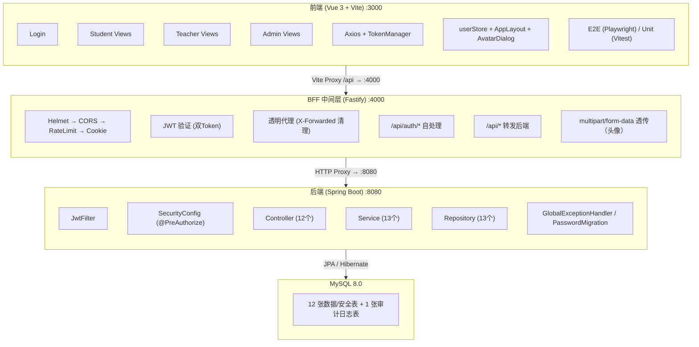
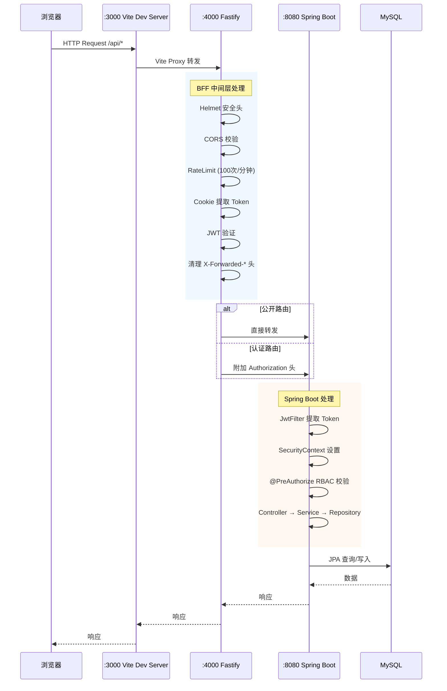
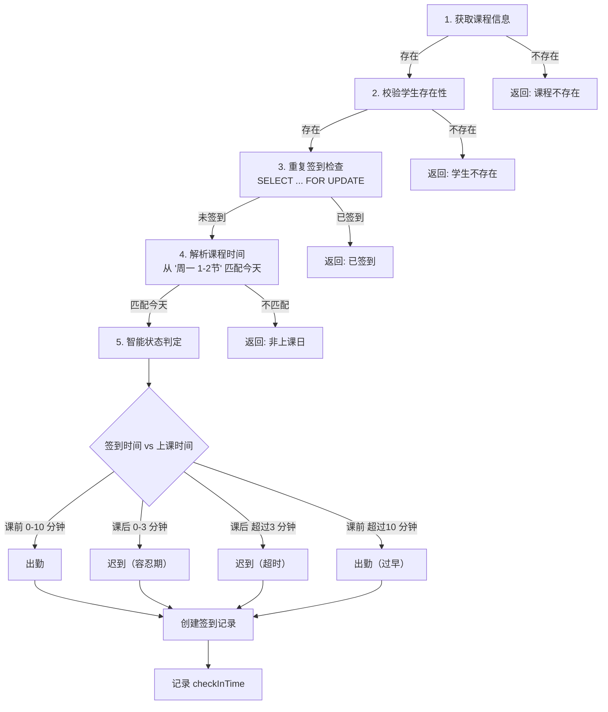
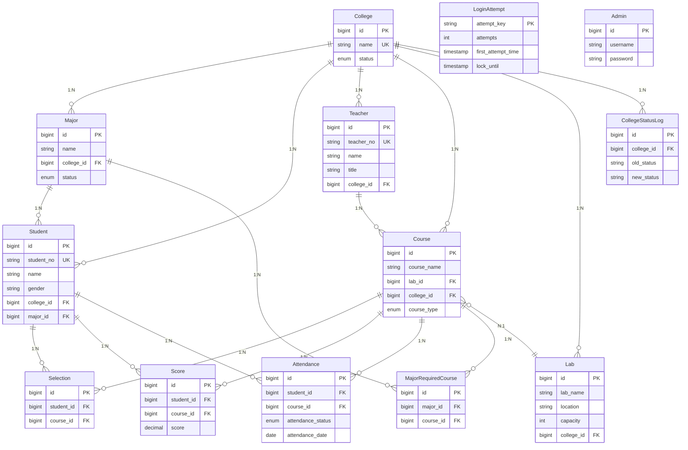
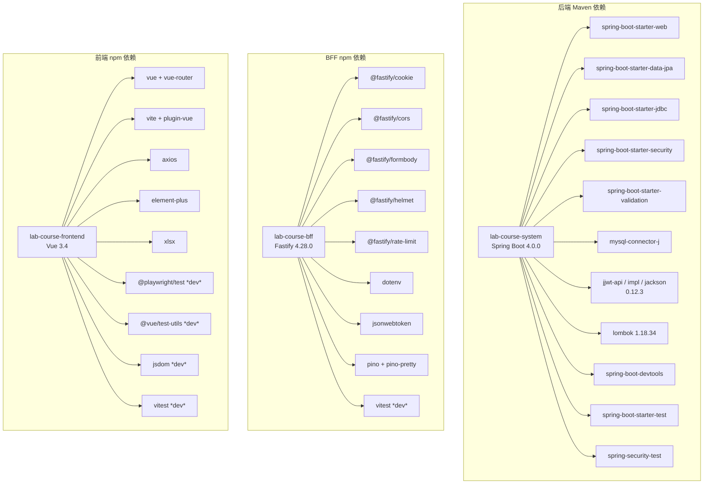
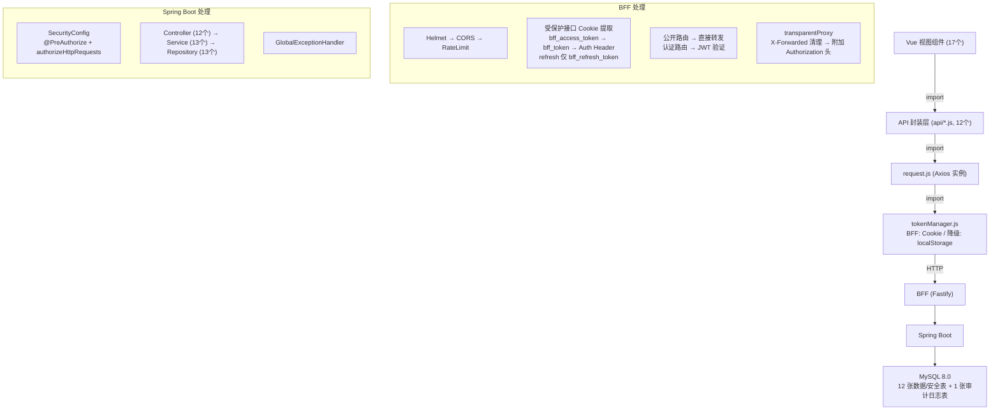
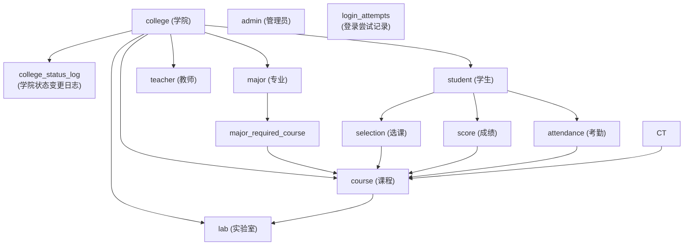

# 实验选课系统 — Code Wiki

> **版本**: 2.3.0 | **最后更新**: 2026-06-20 | **文档类型**: 结构化代码知识库

---

## 目录

1. [项目概述](#1-项目概述)
2. [系统架构](#2-系统架构)
3. [项目目录结构](#3-项目目录结构)
4. [后端模块 (Spring Boot)](#4-后端模块-spring-boot)
   - 4.1 [启动入口](#41-启动入口)
   - 4.2 [配置层 (config)](#42-配置层-config)
   - 4.3 [过滤器 (filter)](#43-过滤器-filter)
   - 4.4 [控制器层 (controller)](#44-控制器层-controller)
   - 4.5 [服务层 (service)](#45-服务层-service)
   - 4.6 [数据访问层 (repository)](#46-数据访问层-repository)
   - 4.7 [实体层 (entity)](#47-实体层-entity)
   - 4.8 [异常处理 (exception)](#48-异常处理-exception)
   - 4.9 [工具类 (util)](#49-工具类-util)
5. [BFF 中间层 (Fastify)](#5-bff-中间层-fastify)
   - 5.1 [入口与配置](#51-入口与配置)
   - 5.2 [路由 (routes)](#52-路由-routes)
   - 5.3 [中间件 (middleware)](#53-中间件-middleware)
   - 5.4 [代理层 (proxy)](#54-代理层-proxy)
   - 5.5 [服务 (services)](#55-服务-services)
   - 5.6 [工具 (utils)](#56-工具-utils)
6. [前端模块 (Vue 3)](#6-前端模块-vue-3)
   - 6.1 [入口与配置](#61-入口与配置)
   - 6.2 [API 封装层 (api)](#62-api-封装层-api)
   - 6.3 [路由 (router)](#63-路由-router)
   - 6.4 [工具模块 (utils)](#64-工具模块-utils)
   - 6.5 [状态管理 (stores)](#65-状态管理-stores)
   - 6.6 [全局组件 (components)](#66-全局组件-components)
   - 6.7 [静态资源 (assets)](#67-静态资源-assets)
   - 6.8 [视图组件 (views)](#68-视图组件-views)
   - 6.9 [E2E 端到端测试](#69-e2e-端到端测试)
7. [数据库设计](#7-数据库设计)
   - 7.1 [ER 图](#71-er-图)
   - 7.2 [表结构详细说明](#72-表结构详细说明)
   - 7.3 [数据库索引设计表](#73-数据库索引设计表)
   - 7.4 [外键约束明细表](#74-外键约束明细表)
   - 7.5 [字段约束表](#75-字段约束表)
   - 7.6 [数据库编程对象](#76-数据库编程对象)
   - 7.7 [数据库脚本文件清单](#77-数据库脚本文件清单)
8. [安全体系](#8-安全体系)
9. [CI/CD 持续集成](#9-cicd-持续集成)
10. [项目运行方式](#10-项目运行方式)
11. [依赖关系图](#11-依赖关系图)

---

## 1. 项目概述

实验选课系统是一个面向**高校实验室课程管理**的完整 Web 应用，采用 **前后端分离 + BFF 中间层** 的三层架构。系统为学生、教师和管理员三类角色提供一站式实验课程管理解决方案，涵盖选课、考勤签到、成绩管理、课表展示、学院/专业管理、系统管理等核心场景。

### 技术栈总览

| 层级 | 技术 | 版本 |
|------|------|------|
| 后端框架 | Spring Boot | 4.0.0 |
| 语言 | Java | 25 |
| 安全框架 | Spring Security + JJWT | 7.0.0 / 0.12.3 |
| ORM | Spring Data JPA (Hibernate) | 4.0.0 / 7.0.0 |
| 数据库 | MySQL | 8.0 |
| 连接池 | HikariCP | — |
| 构建工具 | Maven | 3.9 |
| BFF 中间层 | Fastify (Node.js) | 4.28.0 |
| BFF 安全 | Helmet + Rate Limit | 11.1.1 / 9.1.0 |
| 前端框架 | Vue 3 (Composition API) | 3.4 |
| 构建工具 | Vite | 5.0.8 |
| UI 组件库 | Element Plus | 2.4.4 |
| HTTP 客户端 | Axios | 1.6.2 |
| Excel 导出 | XLSX | 0.18.5 |
| 前端状态管理 | Vue Reactive (userStore) | 3.4 |
| E2E 测试 | Playwright | 1.60.0 |
| 单元测试 | Vitest | 4.1.8 |

### v2.0.0 新增亮点

- **学院/专业管理层级模型**：引入 `college` 和 `major` 独立表，通过外键关联替代原有字符串字段
- **课程分类体系**：课程新增 `course_type` 字段，支持必修(REQUIRED)和选修(ELECTIVE)分类
- **专业-必修课关联**：`major_required_course` 表定义专业教学计划中的必修课
- **课程-教师绑定**：课程通过 `course.teacher_id` 直接绑定授课教师，保持当前 JPA 实体与初始化脚本一致
- **数据库外键约束**：全面采用 `ON DELETE RESTRICT ON UPDATE RESTRICT` 保护数据完整性
- **软删除机制**：学院/专业删除采用状态标记(ACTIVE → INACTIVE)，避免物理删除引发的级联问题
- **级联下拉选择器**：前端学院→专业级联下拉，支持筛选和加载状态
- **E2E 端到端测试**：基于 Playwright 的 13 个 E2E 测试用例覆盖关键业务流程
- **操作日志记录**：管理员对学院/专业的增删改操作记录到 SLF4J 日志

### v2.1.0 新增亮点

- **外键约束全面加固**：所有 19 个外键统一采用 `ON DELETE RESTRICT ON UPDATE RESTRICT`
- **数据完整性约束**：新增 score CHECK 约束(0-100)、gender CHECK 约束('男'/'女')
- **联合索引优化**：新增 3 个联合索引优化核心查询场景
- **lab 表规范化**：新增 college_id 外键列
- **attendance 表字段完善**：新增 check_in_time 字段
- **存储过程**：proc_check_attendance_status + proc_check_course_selection_conflict
- **视图**：v_active_college、v_active_major、v_student_course
- **触发器**：trigger_college_status_update
- **迁移与回滚脚本**：migrate_v1_to_v2.sql + rollback_v2_to_v1.sql
- **数据库级测试**：DatabaseConstraintTest + DatabaseUniqueIndexTest + DatabaseConcurrencyTest

### v2.2.0 新增亮点

- **用户头像系统**：后端 UserController + UserService 支持头像上传（JPG/PNG/WebP，自动裁剪 200×200），前端 AvatarDialog 组件支持头像预览、上传和回显
- **个人信息弹窗**：AvatarDialog 组件展示姓名、账号、学院、职称、角色，支持修改密码
- **统一状态管理**：userStore（Vue Reactive）集中管理用户状态，支持 localStorage 初始化、API 回填、头像更新、登出重置
- **布局配置化**：layoutConfig.js 统一管理三种角色的导航项、品牌信息、占位图，通过 AppLayout 组件渲染
- **SVG 图标系统**：icons.js 统一管理所有导航栏 SVG 图标，支持 `stroke="currentColor"` 继承主题色
- **登录持久化表**：新增 login_attempts 表，将登录失败计数从内存迁移到数据库持久化存储
- **BFF 请求体限制**：由 1MB 调整为 3MB，支持头像上传通过代理

### v2.3.0 新增亮点

- **Spring Boot 4.0.0 升级**：后端框架从 Spring Boot 3.2.0 升级至 4.0.0，Spring Security 7.0.0、Spring Data JPA 4.0.0、Hibernate 7.0.0 同步升级
- **Java 25 适配**：运行时环境从 Java 17 升级至 Java 25（Oracle JDK 25+37-LTS），pom.xml 声明与实际运行环境一致
- **Lombok 1.18.34**：升级至支持 Java 25 的版本
- **CI/CD 适配**：GitHub Actions 流水线 JDK 版本从 17 更新为 25
- **移除废弃 API**：移除 `UserDetailsServiceAutoConfiguration` exclude（SB 4.0.0 中已移除该类）、适配 `@AutoConfigureMockMvc` 移除、`getStatusCodeValue()` → `getStatusCode().value()`

---

## 2. 系统架构

### 2.1 整体架构图



### 2.2 请求流程



### 2.3 BFF 模式与降级模式

Vite 配置支持两种模式切换：

- **BFF 模式** (`VITE_BFF_ENABLED=true`, 默认): 前端请求经 `:3000 → :4000 → :8080`，Token 存储在 HttpOnly Cookie 中（双Token：bff_access_token 30分钟 + bff_refresh_token 7天）
- **降级模式** (`VITE_BFF_ENABLED=false`): 前端直接代理到 `:3000 → :8080`，Token 存储在 localStorage 中

---

## 3. 项目目录结构

```
d:\789\
├── .github/workflows/
│   └── attendance-ci.yml              # GitHub Actions CI 流水线
│
├── backend/                           # Spring Boot 后端
│   ├── pom.xml                        # Maven 依赖配置
│   ├── uploads/avatars/               # 用户头像存储目录
│   └── src/
│       ├── main/java/com/labcourse/
│       │   ├── LabCourseApplication.java    # 启动类
│       │   ├── config/                      # 配置层 (4 个)
│       │   │   ├── SecurityConfig.java      # 安全配置 + CORS + @PreAuthorize
│       │   │   ├── GlobalExceptionHandler.java
│       │   │   ├── PasswordMigration.java
│       │   │   └── WebMvcConfig.java        # 静态资源映射（头像）
│       │   ├── filter/
│       │   │   └── JwtFilter.java           # JWT 认证过滤器
│       │   ├── controller/                  # 控制器层 (12 个)
│       │   ├── service/                     # 服务接口 (13 个)
│       │   │   ├── impl/                    # 服务实现 (12 个)
│       │   │   ├── LoginAttemptService.java
│       │   │   └── MajorRequiredCourseService.java
│       │   ├── repository/                  # 数据访问层 (13 个)
│       │   ├── entity/                      # 实体类 (14 个)
│       │   ├── exception/
│       │   │   └── AccountLockedException.java
│       │   └── util/
│       │       └── JwtUtil.java
│       ├── main/resources/
│       │   ├── application.yml              # 默认配置
│       │   └── application-prod.yml         # 生产配置
│       └── test/java/com/labcourse/        # 测试 (87+ 用例)
│
├── bff/                                # Fastify BFF 中间层
│   ├── package.json
│   ├── .env.example
│   └── src/
│       ├── index.js                    # 入口 (Helmet + RateLimit + 双Token)
│       ├── config.js                   # 配置 (双Token Cookie 名称/有效期)
│       ├── routes/auth.js              # 认证路由 (双Token 签发/刷新/登出)
│       ├── middleware/
│       │   ├── jwtVerify.js            # JWT 验证 (优先 bff_access_token)
│       │   ├── errorHandler.js
│       │   └── requestLogger.js
│       ├── proxy/
│       │   ├── transparentProxy.js     # 透明代理 (X-Forwarded清理)
│       │   └── proxyMapping.js         # 路由映射
│       ├── services/backendClient.js   # 后端 HTTP 客户端
│       └── utils/logger.js             # 日志工具 (脱敏)
│   └── tests/                          # BFF 测试 (5 个测试文件)
│
├── frontend/                           # Vue 3 前端
│   ├── package.json
│   ├── vite.config.js
│   ├── .env.development
│   ├── index.html
│   ├── playwright.config.js            # Playwright E2E 配置
│   └── src/
│       ├── main.js                     # 入口
│       ├── App.vue                     # 根组件
│       ├── api/                        # API 封装 (13 个)
│       ├── router/index.js             # 路由 + 导航守卫
│       ├── stores/userStore.js         # 用户状态管理 (Vue Reactive)
│       ├── components/                 # 全局组件 (2 个)
│       │   ├── AppLayout.vue           # 通用布局（侧边栏 + 主区域）
│       │   └── AvatarDialog.vue        # 个人信息弹窗（头像 + 修改密码）
│       ├── config/layoutConfig.js      # 布局配置 (3 角色导航项)
│       ├── assets/                     # 静态资源
│       │   ├── avatarPlaceholder.js    # SVG 头像占位图
│       │   └── icons.js                # SVG 导航图标
│       ├── utils/                      # 工具模块 (7 个)
│       ├── views/                      # 视图组件 (17 个)
│       │   ├── Login.vue
│       │   ├── student/ (6)  teacher/ (5)  admin/ (6)
│       └── styles/global.css
│   └── tests/e2e/                      # E2E 测试 (14 个用例)
│
├── database/                           # 数据库脚本
│   ├── init_database.sql               # 初始化脚本 (v2.2 — 12张数据/安全表 + 1张审计日志表)
│   ├── procedures.sql                  # 存储过程
│   ├── views_and_triggers.sql          # 视图与触发器
│   ├── queries.sql                     # 常用查询示例
│   ├── migrate_v1_to_v2.sql            # v1→v2 迁移脚本
│   ├── rollback_v2_to_v1.sql           # v2→v1 回滚脚本
│   ├── migration_attendance.sql        # 考勤表结构迁移
│   ├── step1_constraints.sql           # 约束强化脚本
│   ├── step5_procedures.sql            # 存储过程部署
│   ├── step6_views.sql                 # 视图部署
│   ├── deploy_final.sql                # 生产部署脚本
│   ├── rollback_final.sql              # 生产回滚脚本
│   ├── deploy_plan_a.sql               # 部署方案A
│   ├── deploy_procedures_v2.sql        # 存储过程v2部署
│   ├── improvement_plan.sql            # 改进计划脚本
│   ├── fix_procedure.sql               # 存储过程修复
│   ├── batch_students.sql              # 批量学生数据
│   ├── extend_students.sql             # 扩展学生数据
│   ├── maintenance.sql                 # 维护脚本
│   └── migrations/                     # 迁移脚本目录
│       ├── 003_add_avatar_url.sql      # avatar_url 字段迁移
│       └── 003_rollback.sql            # avatar_url 迁移回滚
│
└── README.md
```

---

## 4. 后端模块 (Spring Boot)

### 4.1 启动入口

**文件**: [`LabCourseApplication.java`](file:///d:/789/backend/src/main/java/com/labcourse/LabCourseApplication.java)

```java
@SpringBootApplication
public class LabCourseApplication {
    public static void main(String[] args) {
        SpringApplication.run(LabCourseApplication.class, args);
    }
}
```

标准 Spring Boot 启动类，自动扫描 `com.labcourse` 包下的所有组件。

---

### 4.2 配置层 (config)

#### SecurityConfig

**文件**: [`SecurityConfig.java`](file:///d:/789/backend/src/main/java/com/labcourse/config/SecurityConfig.java)

| 职责 | 说明 |
|------|------|
| RBAC 权限控制 | 基于 `@EnableMethodSecurity` + `@PreAuthorize` 的方法级权限 + `authorizeHttpRequests` 路由级控制 |
| BCrypt 加密 | 提供 `PasswordEncoder` Bean (BCryptPasswordEncoder) |
| CORS 配置 | 允许 `localhost:3000` 和 `localhost:4000` 跨域，显式声明 `allowedHeaders` |
| 会话管理 | 无状态模式 (SessionCreationPolicy.STATELESS) |
| JWT 集成 | 通过 `addFilterBefore` 在 `UsernamePasswordAuthenticationFilter` 之前注册 `JwtFilter` |
| CSRF | 关闭 (前后端分离不需要) |

**接口权限矩阵**:

| 路由前缀 | 角色要求 | 说明 |
|----------|----------|------|
| `/api/student/login`, `/api/teacher/login`, `/api/admin/login` | 匿名 | 登录接口 |
| `/api/course/list`, `/api/course/list/simple` | 匿名 | 课程列表 |
| `/api/auth/refresh`, `/api/auth/logout` | 匿名 (内部自行验证) | Token 刷新/登出 |
| `/api/auth/validate` | 认证即可 | Token 验证 |
| `/api/user/profile` | 认证即可 | 个人信息 |
| `/api/user/avatar` | 认证即可 | 头像上传 |
| `/api/user/change-password` | 认证即可 | 修改密码 |
| `/api/student/add,update,delete,list` | ROLE_admin | 学生管理 |
| `/api/teacher/add,update,delete,list` | ROLE_admin | 教师管理 |
| `/api/course/add,update,delete` | ROLE_admin | 课程管理 |
| `/api/lab/**` | ROLE_admin | 实验室管理 |
| `/api/college/**` | ROLE_admin | 学院管理 |
| `/api/major/**` | ROLE_admin | 专业管理 |
| `/api/selection/add,my,delete` | ROLE_student | 选课操作 |
| `/api/attendance/check-in,history,server-time` | ROLE_student | 学生考勤 |
| `/api/selection/studentList`, `/api/score/**` | ROLE_teacher | 教师查看学生/成绩 |
| `/api/attendance/course,dates,update-status,export` | ROLE_teacher | 教师考勤管理 |

#### GlobalExceptionHandler

**文件**: [`GlobalExceptionHandler.java`](file:///d:/789/backend/src/main/java/com/labcourse/config/GlobalExceptionHandler.java)

全局异常拦截器，使用 `@RestControllerAdvice` 注解，统一处理四类异常：

| 异常类型 | HTTP 状态码 | 说明 |
|----------|-------------|------|
| `MethodArgumentNotValidException` | 400 | 参数校验失败（`@Valid` 触发），返回字段级错误详情 |
| `IllegalArgumentException` | 400 | 非法参数，返回错误消息 |
| `AccountLockedException` | 423 | 账号锁定，返回剩余锁定分钟数 |
| `Exception` (通用) | 500 | 服务器内部错误 |

#### PasswordMigration

**文件**: [`PasswordMigration.java`](file:///d:/789/backend/src/main/java/com/labcourse/config/PasswordMigration.java)

实现 `CommandLineRunner`，在应用启动时自动执行。检查数据库中所有学生、教师、管理员密码，将未被 BCrypt 加密的密码（不以 `$2a$` 开头）自动升级为 BCrypt 哈希。

#### WebMvcConfig

**文件**: [`WebMvcConfig.java`](file:///d:/789/backend/src/main/java/com/labcourse/config/WebMvcConfig.java)

配置静态资源映射，将 `/api/static/avatars/**` 路径映射到本地文件系统 `d:/789/backend/uploads/avatars/` 目录，用于头像文件的访问。

---

### 4.3 过滤器 (filter)

#### JwtFilter

**文件**: [`JwtFilter.java`](file:///d:/789/backend/src/main/java/com/labcourse/filter/JwtFilter.java)

| 属性 | 说明 |
|------|------|
| 基类 | `OncePerRequestFilter` (每个请求执行一次) |
| 执行位置 | 在 `UsernamePasswordAuthenticationFilter` 之前 |
| 核心逻辑 | 从 `Authorization: Bearer <token>` 头提取 Token → `JwtUtil.validateToken()` → 提取 userId 和 role → 构建 `UsernamePasswordAuthenticationToken` → 设置到 `SecurityContextHolder` |
| 异常处理 | 验证失败不抛异常，仅记录日志，让请求继续（由 SecurityConfig 决定是否允许） |

---

### 4.4 控制器层 (controller)

共 **12 个控制器** (v2.2 新增 UserController)：

#### AuthController

**文件**: [`AuthController.java`](file:///d:/789/backend/src/main/java/com/labcourse/controller/AuthController.java)

| 端点 | 方法 | 说明 |
|------|------|------|
| `/api/auth/refresh` | POST | 刷新 Token（需当前有效 Token） |
| `/api/auth/validate` | GET | 验证 Token 有效性，返回剩余时间 |

#### AdminController

**文件**: [`AdminController.java`](file:///d:/789/backend/src/main/java/com/labcourse/controller/AdminController.java)

| 端点 | 方法 | 说明 |
|------|------|------|
| `/api/admin/login` | POST | 管理员登录 |

#### StudentController

**文件**: [`StudentController.java`](file:///d:/789/backend/src/main/java/com/labcourse/controller/StudentController.java)

| 端点 | 方法 | 角色 | 说明 |
|------|------|------|------|
| `/api/student/login` | POST | 匿名 | 学生登录 |
| `/api/student/list` | GET | admin | 查询所有学生（支持 collegeId/majorId 筛选） |
| `/api/student/save` | POST | admin | 新增学生（含 `@Valid` 校验） |
| `/api/student/update` | PUT | admin | 更新学生信息（partial update） |
| `/api/student/{id}` | DELETE | admin | 删除学生 |

#### TeacherController

**文件**: [`TeacherController.java`](file:///d:/789/backend/src/main/java/com/labcourse/controller/TeacherController.java)

| 端点 | 方法 | 角色 | 说明 |
|------|------|------|------|
| `/api/teacher/login` | POST | 匿名 | 教师登录 |
| `/api/teacher/list` | GET | admin | 查询所有教师（支持 collegeId 筛选） |
| `/api/teacher/save` | POST | admin | 新增教师 |
| `/api/teacher/update` | PUT | admin | 更新教师信息 |
| `/api/teacher/{id}` | DELETE | admin | 删除教师 |

#### CourseController

**文件**: [`CourseController.java`](file:///d:/789/backend/src/main/java/com/labcourse/controller/CourseController.java)

| 端点 | 方法 | 角色 | 说明 |
|------|------|------|------|
| `/api/course/list` | GET | 公开 | 查询所有课程（含教师、实验室、选课人数） |
| `/api/course/list/simple` | GET | 公开 | 简化课程列表 |
| `/api/course/save` | POST | admin | 新增课程（支持 courseType、collegeId） |
| `/api/course/update` | PUT | admin | 更新课程 |
| `/api/course/{id}` | DELETE | admin | 删除课程 |

#### LabController

**文件**: [`LabController.java`](file:///d:/789/backend/src/main/java/com/labcourse/controller/LabController.java)

| 端点 | 方法 | 角色 | 说明 |
|------|------|------|------|
| `/api/lab/list` | GET | admin | 查询所有实验室 |
| `/api/lab/save` | POST | admin | 新增实验室 |
| `/api/lab/update` | PUT | admin | 更新实验室 |
| `/api/lab/{id}` | DELETE | admin | 删除实验室 |

#### SelectionController

**文件**: [`SelectionController.java`](file:///d:/789/backend/src/main/java/com/labcourse/controller/SelectionController.java)

| 端点 | 方法 | 角色 | 说明 |
|------|------|------|------|
| `/api/selection/add` | POST | student | 添加选课（返回选课结果或冲突课程名） |
| `/api/selection/delete/{id}` | DELETE | student | 删除选课 |
| `/api/selection/my/{studentId}` | GET | student | 查询某学生的已选课程 |
| `/api/selection/studentList/{courseId}` | GET | teacher | 查询某课程的选课学生列表 |

#### ScoreController

**文件**: [`ScoreController.java`](file:///d:/789/backend/src/main/java/com/labcourse/controller/ScoreController.java)

| 端点 | 方法 | 角色 | 说明 |
|------|------|------|------|
| `/api/score/add` | POST | teacher | 录入/更新学生成绩 |
| `/api/score/list` | GET | teacher | 查询所有成绩记录 |

#### AttendanceController

**文件**: [`AttendanceController.java`](file:///d:/789/backend/src/main/java/com/labcourse/controller/AttendanceController.java)

| 端点 | 方法 | 角色 | 说明 |
|------|------|------|------|
| `/api/attendance/check-in` | POST | student | 学生签到（从JWT获取studentId，自动判定出勤/迟到） |
| `/api/attendance/history` | GET | student | 查询某学生的签到历史（学生只能查自己） |
| `/api/attendance/course` | GET | teacher | 按日期查询课程考勤详情 |
| `/api/attendance/dates` | GET | teacher | 获取课程的所有考勤日期列表 |
| `/api/attendance/update-status` | PUT | teacher | 修改考勤状态（仅缺勤→请假，teacherId从JWT获取） |
| `/api/attendance/export` | GET | teacher | 导出考勤数据 |
| `/api/attendance/server-time` | GET | student | 获取服务器当前时间 |
| `/api/attendance/add` | POST | 兼容 | 旧版考勤录入（studentId从JWT获取） |

#### CollegeController

**文件**: [`CollegeController.java`](file:///d:/789/backend/src/main/java/com/labcourse/controller/CollegeController.java)

`@PreAuthorize("hasRole('admin')")` — 仅管理员可操作。

| 端点 | 方法 | 说明 |
|------|------|------|
| `/api/college/list` | GET | 查询学院列表（支持按名称搜索、状态筛选、分页排序） |
| `/api/college/add` | POST | 新增学院（`@Valid` 校验名称唯一性） |
| `/api/college/update` | PUT | 更新学院（名称/状态 partial update） |
| `/api/college/delete/{id}` | DELETE | 删除学院（软删除：ACTIVE → INACTIVE，检查关联数据） |

#### MajorController

**文件**: [`MajorController.java`](file:///d:/789/backend/src/main/java/com/labcourse/controller/MajorController.java)

`@PreAuthorize("hasRole('admin')")` — 仅管理员可操作。

| 端点 | 方法 | 说明 |
|------|------|------|
| `/api/major/list` | GET | 查询专业列表（支持按名称、学院ID、状态筛选、分页排序） |
| `/api/major/list/by-college/{collegeId}` | GET | 按学院ID查询该学院下所有启用的专业（级联下拉数据源） |
| `/api/major/add` | POST | 新增专业（`@Valid` 校验，同学院下名称唯一） |
| `/api/major/update` | PUT | 更新专业（名称/collegeId/状态 partial update） |
| `/api/major/delete/{id}` | DELETE | 删除专业（软删除，检查关联学生） |

#### UserController (v2.2 新增)

**文件**: [`UserController.java`](file:///d:/789/backend/src/main/java/com/labcourse/controller/UserController.java)

| 端点 | 方法 | 角色 | 说明 |
|------|------|------|------|
| `/api/user/avatar` | POST | 认证即可 | 上传头像（JPG/PNG/WebP，≤2MB，自动裁剪200×200） |
| `/api/user/profile` | GET | 认证即可 | 获取当前用户个人信息（姓名/账号/头像/学院/职称） |
| `/api/user/change-password` | PUT | 认证即可 | 修改密码（需旧密码验证） |

---

### 4.5 服务层 (service)

#### 服务接口与实现映射

| 接口文件 | 实现类文件 | 核心功能 |
|----------|-----------|----------|
| `AdminService.java` | `AdminServiceImpl.java` | 管理员登录、增删改查 |
| `StudentService.java` | `StudentServiceImpl.java` | 学生登录、增删改查 |
| `TeacherService.java` | `TeacherServiceImpl.java` | 教师登录、增删改查 |
| `CourseService.java` | `CourseServiceImpl.java` | 课程增删改查 |
| `LabService.java` | `LabServiceImpl.java` | 实验室增删改查 |
| `SelectionService.java` | `SelectionServiceImpl.java` | 选课/退课业务逻辑 |
| `ScoreService.java` | `ScoreServiceImpl.java` | 成绩录入/更新 |
| `AttendanceService.java` | `AttendanceServiceImpl.java` | 考勤签到核心逻辑 |
| `CollegeService.java` | `CollegeServiceImpl.java` | 学院层级管理 |
| `MajorService.java` | `MajorServiceImpl.java` | 专业层级管理 |
| `UserService.java` | `UserServiceImpl.java` | **v2.2 新增**: 头像上传/个人信息/修改密码 |
| `LoginAttemptService.java` | — | 登录失败限制服务 |
| `MajorRequiredCourseService.java` | — | 专业-必修课关联服务 |

#### AttendanceServiceImpl — 核心签到逻辑详解

**文件**: [`AttendanceServiceImpl.java`](file:///d:/789/backend/src/main/java/com/labcourse/service/impl/AttendanceServiceImpl.java)

**签到流程 (checkIn)**:



**节次-时间映射表**:

| 节次 | 开始时间 |
|------|---------|
| 1 | 08:00 |
| 3 | 10:00 |
| 5 | 14:00 |
| 7 | 16:00 |
| 9 | 19:00 |

**状态修改规则**: 仅允许将"缺勤"修改为"请假"，其他转换一律拒绝。修改时记录 `modifiedBy`、`modifyTime`、`modifyReason`。

#### UserServiceImpl — 用户服务详解 (v2.2 新增)

**文件**: [`UserServiceImpl.java`](file:///d:/789/backend/src/main/java/com/labcourse/service/impl/UserServiceImpl.java)

| 方法 | 说明 |
|------|------|
| `saveAvatar(MultipartFile file)` | 头像上传：验证格式(JPG/PNG/WebP)和大小(≤2MB) → 中心裁剪为正方形 → 缩放至200×200 → 保存PNG到 `d:/789/backend/uploads/avatars/` → 更新数据库 avatarUrl → 删除旧头像文件 |
| `getProfile()` | 获取个人信息：从JWT提取userId和role → 根据角色查询对应表 → 返回 name/account/avatarUrl/college/title |
| `changePassword(oldPassword, newPassword)` | 修改密码：验证旧密码(BCrypt) → 加密新密码 → 更新对应表 |

**关键实现细节**:
- 头像文件名使用 UUID 避免冲突
- 更新头像前先删除旧文件（best-effort）
- 数据库更新失败时回滚已保存的文件
- 从 JWT Token 提取用户身份，而非信任请求参数

---

### 4.6 数据访问层 (repository)

全部使用 Spring Data JPA 的 `JpaRepository` 接口，共 **13 个**：

| Repository | 对应的实体 | 关键自定义查询方法 |
|------------|-----------|-------------------|
| `AdminRepository` | Admin | `findByUsername(String)` |
| `StudentRepository` | Student | `findByStudentNo(String)`, `countByCollegeId(Long)`, `countByMajorId(Long)` |
| `TeacherRepository` | Teacher | `findByTeacherNo(String)`, `countByCollegeId(Long)` |
| `CourseRepository` | Course | `findByTeacherId(Long)`, `findByCollegeId(Long)` |
| `LabRepository` | Lab | 无自定义方法 |
| `SelectionRepository` | Selection | `findByStudentId()`, `findByCourseId()`, `findByStudentIdAndCourseId()`, `countByCourseId()` |
| `ScoreRepository` | Score | `findByStudentIdAndCourseId()` |
| `AttendanceRepository` | Attendance | `findByStudentIdAndCourseIdAndAttendanceDate()`, `findByStudentIdAndCourseIdAndAttendanceDateForUpdate()`(悲观锁), `findByCourseIdAndAttendanceDate()`, `findByStudentIdOrderByAttendanceDateDesc()`, `findByCourseIdOrderByAttendanceDateDesc()` |
| `CollegeRepository` | College | `findByName(String)`, `findByNameContaining(String, Pageable)`, `findByStatus(String, Pageable)`, `findByNameContainingAndStatus(String, String, Pageable)` |
| `MajorRepository` | Major | `findByCollegeId(Long, Pageable)`, `findByCollegeIdAndName(Long, String)`, `findByCollegeIdAndStatus(Long, String)`, `findByNameContaining(String, Pageable)`, `countByCollegeId(Long)` |
| `MajorRequiredCourseRepository` | MajorRequiredCourse | 专业-必修课关联查询 |
| `LoginAttemptRepository` | LoginAttempt | 登录尝试记录查询 |

---

### 4.7 实体层 (entity)

共 **14 个实体类**：

| 实体类 | 对应表 | 核心字段 | 备注 |
|--------|--------|----------|------|
| `Admin` | admin | id, username, password, avatarUrl, refreshToken, createdAt, updatedAt | v2.2 新增 avatarUrl |
| `College` | college | id, name, status, createdAt, updatedAt | v2.0 新增 |
| `Major` | major | id, name, collegeId, status, createdAt, updatedAt | v2.0 新增 |
| `Student` | student | id, studentNo, name, gender, college, collegeId, majorId, password, avatarUrl, refreshToken, createdAt, updatedAt | v2.2 新增 avatarUrl |
| `Teacher` | teacher | id, teacherNo, name, title, college, collegeId, password, avatarUrl, refreshToken, createdAt, updatedAt | v2.2 新增 avatarUrl |
| `Course` | course | id, courseName, teacherId, labId, courseTime, maxCount, college, collegeId, courseType, createdAt, updatedAt | — |
| `Lab` | lab | id, labName, location, capacity, college, collegeId, createdAt, updatedAt | — |
| `Selection` | selection | id, studentId, courseId, selectTime, createdAt, updatedAt | — |
| `Score` | score | id, studentId, courseId, score, createdAt, updatedAt | — |
| `Attendance` | attendance | id, studentId, courseId, attendanceStatus, attendanceDate, checkInTime, modifiedBy, modifyTime, modifyReason, createdAt, updatedAt | — |
| `AttendanceStatus` | — (枚举) | 出勤, 请假, 缺勤, 迟到 | — |
| `MajorRequiredCourse` | major_required_course | id, majorId, courseId, createdAt | v2.0 新增 |
| `LoginAttempt` | login_attempts | attemptKey, attempts, firstAttemptTime, lockUntil | v2.2 新增 |

**过渡字段淘汰计划**: Student、Teacher、Course、Lab 四个实体同时保留字符串 `college` 字段和 `collegeId`/`majorId` 外键字段，实现平滑过渡。

所有实体类都使用 `@PrePersist` / `@PreUpdate` 自动管理 `createdAt` / `updatedAt` 时间戳。

---

### 4.8 异常处理 (exception)

#### AccountLockedException

**文件**: [`AccountLockedException.java`](file:///d:/789/backend/src/main/java/com/labcourse/exception/AccountLockedException.java)

```java
public class AccountLockedException extends RuntimeException {
    private final long remainingMinutes;
}
```

由 `LoginAttemptService` 抛出，在 `GlobalExceptionHandler` 中捕获，返回 HTTP 423。

---

### 4.9 工具类 (util)

#### JwtUtil

**文件**: [`JwtUtil.java`](file:///d:/789/backend/src/main/java/com/labcourse/util/JwtUtil.java)

| 方法 | 说明 |
|------|------|
| `generateAccessToken(Long userId, String username, String role)` | 生成 30 分钟 Access Token，包含 username、role、type=access |
| `generateRefreshToken(Long userId)` | 生成 7 天 Refresh Token，包含 tokenId、type=refresh |
| `validateAccessToken(String token)` | 验证 Access Token 并返回 Claims |
| `validateRefreshToken(String token)` | 验证 Refresh Token 并返回 Claims |
| `parseToken(String token)` | 解析 Token，返回 Claims |
| `extractUserId(String token)` | 提取 userId |
| `extractRole(String token)` | 提取角色 |
| `getUsernameFromToken(String token)` | 提取用户名 |
| `validateToken(String token)` | 验证 Token 是否有效 |
| `isTokenExpired(String token)` | 检查是否过期 |

**配置项** (`application.yml`):

| 配置项 | 环境变量 | 说明 |
|--------|----------|------|
| `jwt.secret` | `JWT_SECRET` (必须) | 签名密钥，必须从环境变量加载 |
| `jwt.expiration` | `JWT_EXPIRATION` | Token 有效期(毫秒)，默认 86400000 (24h) |

**签名算法**: HS256/HS384/HS512

---

## 5. BFF 中间层 (Fastify)

BFF (Backend For Frontend) 层是基于 **Fastify 4.x** 构建的 Node.js 中间服务，运行在 `:4000`。主要职责：

- 作为前端与后端的**认证网关**，将 JWT Token 存储在 HttpOnly Cookie 中
- 实现**双Token 机制**：Access Token (30分钟) + Refresh Token (7天) 分离存储
- 对外提供**统一的 API 入口**，对内透明代理到 Spring Boot
- 处理**登录**、**Token 刷新（轮转）**、**登出**等认证相关操作
- 提供**安全防护**：Helmet 安全头、Rate Limiting、请求体大小限制、X-Forwarded 清理
- 支持 **multipart/form-data** 透传（头像上传）

### 5.1 入口与配置

#### index.js

**文件**: [`index.js`](file:///d:/789/bff/src/index.js)

核心函数 `buildApp()` 构建 Fastify 应用：

1. 注册安全插件：`@fastify/helmet` (CSP + X-Frame-Options: DENY)、`@fastify/rate-limit` (生产默认100次/分钟/IP，本地可通过 `RATE_LIMIT_MAX` 调整)
2. 注册基础插件：`@fastify/cors` (localhost:3000, credentials=true, 显式 allowedHeaders)、`@fastify/cookie`、`@fastify/formbody` (3MB限制)
3. 注册 multipart/form-data content type parser（透传 buffer 给后端）
4. 注册请求日志钩子
5. 设置认证路由 (`/api/student/login`, `/api/teacher/login`, `/api/admin/login`, `/api/auth/refresh`, `/api/auth/logout`)
6. 注册透明代理插件 (处理其他所有 `/api/*` 请求)
7. 设置全局错误处理

导出 `buildApp()` 用于测试。

#### config.js

**文件**: [`config.js`](file:///d:/789/bff/src/config.js)

| 配置项 | 环境变量 | 默认值 |
|--------|----------|--------|
| 端口 | `BFF_PORT` | `4000` |
| 后端地址 | `BACKEND_URL` | `http://localhost:8080` |
| 运行环境 | `NODE_ENV` | `development` |
| JWT 密钥 | `JWT_SECRET` | (必须设置) |
| JWT 有效期 | `JWT_EXPIRATION` | `86400000` (24h) |
| Access Token Cookie | `bff_access_token` | 30分钟 |
| Refresh Token Cookie | `bff_refresh_token` | 7天 |
| 兼容旧版 Cookie | `bff_token` | 仅受保护接口兼容读取，refresh 不接受 |
| 日志级别 | `LOG_LEVEL` | `info` |

---

### 5.2 路由 (routes)

#### auth.js

**文件**: [`auth.js`](file:///d:/789/bff/src/routes/auth.js)

**`createLoginHandler` 工厂函数**: 创建通用的登录处理函数，签发 Access/Refresh 双 Token Cookie。

```
登录流程 (双Token模式):
  参数校验(用户名+密码非空) 
  → 转发请求到后端 (/api/student|teacher|admin/login) 
  → 成功后从响应提取 accessToken + refreshToken
  → 签发 HttpOnly Cookie:
    ├─ bff_access_token (30分钟, path=/)
    └─ bff_refresh_token (7天, path=/api/auth)
  → 返回用户信息(不含 Token，前端通过 Cookie 使用)
  → 失败则返回 401 或 502
```

三个登录路由使用不同的 `usernameField`:
- `/api/student/login` → `studentNo`
- `/api/teacher/login` → `teacherNo`
- `/api/admin/login` → `username`

**`/api/auth/refresh`**: 仅读取 `bff_refresh_token` HttpOnly Cookie → 本地预验证 JWT 格式和过期 → 透传到后端执行 Token 轮转刷新 → 更新 Access/Refresh 两个 Cookie。Authorization Header 和旧版 `bff_token` 不触发刷新。

**`/api/auth/logout`**: 清除 `bff_access_token`、`bff_refresh_token`、`bff_token` 三个 Cookie → 通知后端清除 refreshToken

---

### 5.3 中间件 (middleware)

#### jwtVerify (JWT 验证)

**文件**: [`jwtVerify.js`](file:///d:/789/bff/src/middleware/jwtVerify.js)

| 功能 | 说明 |
|------|------|
| Token 来源 | 受保护接口优先从 Cookie (`bff_access_token`) 读取，兼容旧版 `bff_token`；`/api/auth/refresh` 仅接受 `bff_refresh_token` HttpOnly Cookie |
| 验证逻辑 | 使用 `jsonwebtoken.verify()` 验证签名和过期时间，支持 HS256/HS384/HS512 算法 |
| Token 透传 | 验证通过后将 Token 重新附加到 `request.headers.authorization` |
| 用户注入 | 验证通过后设置 `request.user = { userId, username, role }` |
| 错误处理 | 过期返回 401 + "Token 已过期" 并清除 `bff_access_token`/`bff_token`，无效返回 401 + "Token 无效" |

#### errorHandler

**文件**: [`errorHandler.js`](file:///d:/789/bff/src/middleware/errorHandler.js)

全局错误处理：生产环境隐藏内部错误详情，开发环境返回完整错误信息。

#### requestLogger

**文件**: [`requestLogger.js`](file:///d:/789/bff/src/middleware/requestLogger.js)

请求生命周期日志：进入时记录方法+路径+IP，完成时记录状态码+耗时。

---

### 5.4 代理层 (proxy)

#### proxyMapping

**文件**: [`proxyMapping.js`](file:///d:/789/bff/src/proxy/proxyMapping.js)

路由认证策略映射，与后端 `SecurityConfig.java` 保持一致：

```javascript
public: [
  '/api/student/login', '/api/teacher/login', '/api/admin/login',
  '/api/course/list', '/api/course/list/simple'
]
authenticated: [
  '/api/admin/', '/api/attendance/', '/api/auth/refresh', '/api/auth/validate',
  '/api/college/', '/api/course/', '/api/course-teacher/',
  '/api/lab/', '/api/major/', '/api/major-required-course/',
  '/api/score/', '/api/selection/', '/api/student/', '/api/teacher/',
  '/api/user/'
]
```

#### transparentProxy

**文件**: [`transparentProxy.js`](file:///d:/789/bff/src/proxy/transparentProxy.js)

透明代理插件，使用 Fastify 的通配路由 `/api/*` 匹配所有 API 请求：

1. **preHandler**: 根据 proxyMapping 决定是否需要 `jwtVerify`
2. **handler**: 转发请求到后端，透传请求头/请求体/状态码/响应头
3. **安全处理**: 清理客户端传入的 `X-Forwarded-*` 头（防 IP 欺骗），设置正确的代理头
4. **特殊处理**: 识别二进制响应（Excel 导出等），使用 `arrayBuffer` 处理

---

### 5.5 服务 (services)

#### backendClient

**文件**: [`backendClient.js`](file:///d:/789/bff/src/services/backendClient.js)

封装对 Spring Boot 后端的 HTTP 调用：

| 方法 | 说明 |
|------|------|
| `request(method, path, options)` | 通用请求方法，返回 JSON 或原始响应 |
| `get(path, options)` | GET 请求 |
| `post(path, body, options)` | POST 请求 |
| `put(path, body, options)` | PUT 请求 |
| `delete(path, options)` | DELETE 请求 |

支持 JSON 和非 JSON 响应，记录请求耗时和错误日志。

---

### 5.6 工具 (utils)

#### logger.js

**文件**: [`logger.js`](file:///d:/789/bff/src/utils/logger.js)

```javascript
createLogger(module)  // 返回 { info, warn, error, debug }
maskSensitive(obj, keys)  // 脱敏指定字段（password, token, secret 等）
```

日志格式: `[ISO时间戳] [BFF:模块] [级别] 消息 | key=value | ...`

---

## 6. 前端模块 (Vue 3)

### 6.1 入口与配置

#### main.js

**文件**: [`main.js`](file:///d:/789/frontend/src/main.js)

创建 Vue 应用，全局注册 Element Plus 和 Router，挂载到 `#app`。

#### vite.config.js

**文件**: [`vite.config.js`](file:///d:/789/frontend/vite.config.js)

| 配置项 | 值 | 说明 |
|--------|-----|------|
| 开发端口 | 3000 | 前端开发服务器 |
| 代理目标 (BFF) | `http://localhost:4000` | BFF 模式默认 |
| 代理目标 (直连) | `http://localhost:8080` | 降级模式 |
| 路径别名 `@` | `src/` | 模块导入快捷方式 |
| 测试环境 | jsdom | Vitest 配置 |

环境变量 `VITE_BFF_ENABLED` 控制代理目标。`.env.development` 中默认为 `true`。

#### App.vue

**文件**: [`App.vue`](file:///d:/789/frontend/src/App.vue)

根组件，包含 `<router-view />` 和全局样式。

---

### 6.2 API 封装层 (api)

每个 API 模块对应一个后端 Controller，共 **12 个文件** (v2.2 新增 user.js)：

| API 模块 | 文件 | 对应后端 Controller | 说明 |
|----------|------|---------------------|------|
| auth | [`auth.js`](file:///d:/789/frontend/src/api/auth.js) | AuthController | Token 刷新/验证 |
| admin | [`admin.js`](file:///d:/789/frontend/src/api/admin.js) | AdminController | 管理员登录 |
| student | [`student.js`](file:///d:/789/frontend/src/api/student.js) | StudentController | 学生 CRUD |
| teacher | [`teacher.js`](file:///d:/789/frontend/src/api/teacher.js) | TeacherController | 教师 CRUD |
| course | [`course.js`](file:///d:/789/frontend/src/api/course.js) | CourseController | 课程 CRUD |
| lab | [`lab.js`](file:///d:/789/frontend/src/api/lab.js) | LabController | 实验室 CRUD |
| selection | [`selection.js`](file:///d:/789/frontend/src/api/selection.js) | SelectionController | 选课操作 |
| score | [`score.js`](file:///d:/789/frontend/src/api/score.js) | ScoreController | 成绩录入 |
| attendance | [`attendance.js`](file:///d:/789/frontend/src/api/attendance.js) | AttendanceController | 考勤签到 |
| college | [`college.js`](file:///d:/789/frontend/src/api/college.js) | CollegeController | 学院管理 |
| major | [`major.js`](file:///d:/789/frontend/src/api/major.js) | MajorController | 专业管理 |
| user | [`user.js`](file:///d:/789/frontend/src/api/user.js) | UserController | **v2.2新增**: 头像上传/个人信息/修改密码 |

所有 API 模块统一通过 `axios` 实例 (来自 `utils/request.js`) 发起请求。

**user.js**: 封装 `uploadAvatar(file)` / `getUserProfile()` / `changePassword(data)` 三个方法。

---

### 6.3 路由 (router)

**文件**: [`index.js`](file:///d:/789/frontend/src/router/index.js)

#### 路由表

| 路径 | 组件 | 角色 | 说明 |
|------|------|------|------|
| `/` | — | 公开 | 重定向到 `/login` |
| `/login` | Login.vue | 公开 | 登录页 |
| `/student/*` | StudentLayout.vue | student | 学生端布局 |
| `/teacher/*` | TeacherLayout.vue | teacher | 教师端布局 |
| `/admin/*` | AdminLayout.vue | admin | 管理员端布局 |

#### 嵌套路由

| 父路由 | 子路径 | 子组件 | 说明 |
|--------|--------|--------|------|
| `/student` | `course` | StudentCourse.vue | 课程列表（选课） |
| `/student` | `my-course` | StudentMyCourse.vue | 我的课程 |
| `/student` | `schedule` | StudentSchedule.vue | 我的课表 |
| `/student` | `attendance` | StudentAttendance.vue | 课堂签到 |
| `/student` | `attendance-history` | StudentAttendanceHistory.vue | 考勤记录 |
| `/teacher` | `course` | TeacherCourse.vue | 我的课程 |
| `/teacher` | `student-list/:courseId` | TeacherStudentList.vue | 选课学生名单 |
| `/teacher` | `score` | TeacherScore.vue | 成绩录入 |
| `/teacher` | `attendance` | TeacherAttendance.vue | 考勤管理 |
| `/admin` | `student` | AdminStudent.vue | 学生管理 |
| `/admin` | `teacher` | AdminTeacher.vue | 教师管理 |
| `/admin` | `course` | AdminCourse.vue | 课程管理 |
| `/admin` | `lab` | AdminLab.vue | 实验室管理 |
| `/admin` | `college-major` | AdminCollegeMajor.vue | 学院专业管理 |

#### 导航守卫

`beforeEach` 守卫实现：
- 无 Token → 重定向到 `/login`
- **BFF 模式** (`_bffMode: true`): 信任后端 API 授权，前端路由不做角色校验
- **降级模式**: Token 存在但角色不匹配 → 重定向到对应首页
- 已登录访问 `/login` → 重定向到对应首页

---

### 6.4 工具模块 (utils)

#### request.js — HTTP 客户端封装

**文件**: [`request.js`](file:///d:/789/frontend/src/utils/request.js)

| 功能 | 说明 |
|------|------|
| 基础配置 | baseURL: `/api`, timeout: 10s, withCredentials: true |
| BFF 模式 | `VITE_BFF_ENABLED !== 'false'` → Cookie 自动携带 |
| 降级模式 | 手动管理 Token，过期自动刷新 |
| 请求拦截器 | 附加 Authorization 头 (降级模式), Token 快过期时自动刷新 |
| 响应拦截器 | 统一错误处理: 401→重新登录, 403→权限不足, 423→账号锁定 |
| 请求队列 | Token 刷新期间挂起的请求排队，刷新完成后统一重发 |

#### tokenManager.js — Token 生命周期管理

**文件**: [`tokenManager.js`](file:///d:/789/frontend/src/utils/tokenManager.js)

| 功能 | BFF 模式 | 降级模式 |
|------|----------|----------|
| Token 存储 | Cookie (HttpOnly) | localStorage |
| Token 读取 | 返回 null (由 Cookie 携带) | 从 localStorage 读取 |
| Token 刷新 | `fetch /api/auth/refresh` 静默刷新 | Axios 请求并存储新 Token |
| 过期检测 | 返回 false (由 BFF 管理) | 比较时间戳 |
| 快过期阈值 | — | 10 分钟 |

#### offlineCheckin.js — 离线签到队列

**文件**: [`offlineCheckin.js`](file:///d:/789/frontend/src/utils/offlineCheckin.js)

| 方法 | 说明 |
|------|------|
| `enqueueCheckIn(studentId, courseId)` | 加入离线队列（自动去重） |
| `getQueue()` | 获取队列 |
| `removeFromQueue(studentId, courseId)` | 从队列移除 |
| `clearQueue()` | 清空队列 |
| `getQueueSize()` | 获取队列大小 |

存储位置: localStorage (`offline_checkin_queue`)

#### scheduleParser.js — 课表解析与冲突检测

**文件**: [`scheduleParser.js`](file:///d:/789/frontend/src/utils/scheduleParser.js)

| 方法 | 说明 |
|------|------|
| `parseCourseTime(courseTime)` | 解析 "周一 1-2节" → `{day, dayName, periods, startPeriod, endPeriod, time}` |
| `detectConflict(timeA, timeB)` | 检测两个课程时间是否冲突 |
| `detectConflictWithList(newCourseTime, existingCourses)` | 检测新课程是否与已有课程冲突 |
| `buildScheduleGrid(courses)` | 构建 7×5 课表网格数据 |

内置节次映射: 1-2节(08:00-09:40), 3-4节(10:00-11:40), 5-6节(14:00-15:40), 7-8节(16:00-17:40), 9-10节(19:00-20:40)

#### scheduleEventBus.js / scheduleCache.js

用于课表数据的跨组件通信和缓存管理。

#### passwordValidator.js

**文件**: [`passwordValidator.js`](file:///d:/789/frontend/src/utils/passwordValidator.js)

密码强度校验规则：
- 长度 8-20 字符
- 不能包含空格
- 必须包含大小写字母、数字、特殊符号中至少**三种**

---

### 6.5 状态管理 (stores)

#### userStore.js (v2.2 新增)

**文件**: [`userStore.js`](file:///d:/789/frontend/src/stores/userStore.js)

基于 Vue 3 `reactive()` 的轻量级状态管理：

| 属性/方法 | 说明 |
|-----------|------|
| `name` | 用户姓名 |
| `account` | 账号（学号/工号/用户名） |
| `avatarUrl` | 头像 URL |
| `college` | 学院名称 |
| `title` | 职称（仅教师） |
| `role` | 角色（student/teacher/admin） |
| `loaded` | 是否已加载 |
| `initFromLocalStorage()` | 从 localStorage 恢复用户状态 |
| `fetchProfile()` | 调用 `/api/user/profile` 获取最新信息并同步到 localStorage |
| `updateAvatar(url)` | 更新头像 URL 并同步到 localStorage |
| `reset()` | 登出时清空所有状态 |

---

### 6.6 全局组件 (components)

#### AppLayout.vue (v2.2 新增)

**文件**: [`AppLayout.vue`](file:///d:/789/frontend/src/components/AppLayout.vue)

通用布局组件，通过 props 接收 `config` 对象实现三种角色的统一布局。提供：

- **侧边栏**：品牌标识 + 用户头像（点击弹出 AvatarDialog）+ 导航菜单 + 退出登录按钮
- **主内容区**：通过 `<slot />` 渲染子路由内容
- **移动端适配**：汉堡菜单按钮 + 侧边栏遮罩层
- **键盘支持**：ESC 关闭移动端侧边栏
- **头像错误处理**：加载失败时回退到占位图

**Props**:
- `config: { role, brandSub, userNameFallback, userRolePrefix, accountFallback, placeholder, navItems }`

#### AvatarDialog.vue (v2.2 新增)

**文件**: [`AvatarDialog.vue`](file:///d:/789/frontend/src/components/AvatarDialog.vue)

个人信息弹窗组件，功能包括：

- **头像展示与上传**：点击头像触发文件选择，前端裁剪为正方形后上传，支持 JPG/PNG/WebP（≤2MB）
- **信息展示**：姓名、账号、学院（学生/教师）、职称（教师）、角色标签
- **修改密码**：嵌套子对话框，验证旧密码 → 校验新密码强度 → 确认密码一致性 → 提交

**Props**: `modelValue`, `role`, `userName`, `userAccount`, `avatarUrl`, `college`, `title`
**Emits**: `update:modelValue`, `avatar-updated`

---

### 6.7 静态资源 (assets)

#### avatarPlaceholder.js (v2.2 新增)

**文件**: [`avatarPlaceholder.js`](file:///d:/789/frontend/src/assets/avatarPlaceholder.js)

导出三种角色的 SVG 占位头像（base64 data URI）：
- `teacherPlaceholder` — 深蓝色系
- `studentPlaceholder` — 蓝绿色系
- `adminPlaceholder` — 棕色系

#### icons.js (v2.2 新增)

**文件**: [`icons.js`](file:///d:/789/frontend/src/assets/icons.js)

统一管理所有导航栏 SVG 图标，通过 `v-html` 渲染，`stroke="currentColor"` 继承主题色。

导出三个图标集：
- `adminIcons` — 学生管理、教师管理、课程管理、实验室、学院专业管理
- `teacherIcons` — 课程、成绩、考勤
- `studentIcons` — 课程列表、我的课程、课表、签到、考勤记录

#### layoutConfig.js (v2.2 新增)

**文件**: [`layoutConfig.js`](file:///d:/789/frontend/src/config/layoutConfig.js)

统一管理三种角色的布局配置，导出 `adminLayoutConfig`、`teacherLayoutConfig`、`studentLayoutConfig`。

每个配置包含：
- `role` — 角色标识
- `brandSub` — 侧边栏副标题
- `userNameFallback` — 用户名为空时的兜底
- `accountFallback` — 账号为空时的兜底
- `placeholder` — 头像占位图
- `navItems` — 导航项数组 `[{ to, icon, label }]`

---

### 6.8 视图组件 (views)

#### 登录页

**文件**: [`Login.vue`](file:///d:/789/frontend/src/views/Login.vue)

角色选择（学生/教师/管理员）→ 表单输入 → 表单验证 → 登录请求 → 存储用户信息 → 跳转角色首页。

**BFF 模式存储策略**: 登录成功后仅存储 `{ _bffMode: true, token: 'bff-cookie', id: result.data?.id }`，不存储敏感身份信息。

#### 布局组件

| 组件 | 角色 | 侧边栏菜单 |
|------|------|-----------|
| `StudentLayout.vue` | 学生 | 课程列表, 我的课程, 我的课表, 课堂签到, 考勤记录 |
| `TeacherLayout.vue` | 教师 | 我的课程, 成绩录入, 考勤录入 |
| `AdminLayout.vue` | 管理员 | 学生管理, 教师管理, 课程管理, 实验室管理, 学院专业管理 |

所有布局组件均使用 `AppLayout` 组件，通过 `layoutConfig.js` 配置驱动。

#### 学生端视图 (6 个)

| 组件 | 功能 |
|------|------|
| `StudentCourse.vue` | 浏览所有课程、选课（冲突检测）、退课 |
| `StudentMyCourse.vue` | 查看已选课程、退课操作 |
| `StudentSchedule.vue` | 周课表视图、跨 Tab 实时刷新 |
| `StudentAttendance.vue` | 实时签到、自动状态判定、离线队列支持 |
| `StudentAttendanceHistory.vue` | 签到历史记录展示 |

#### 教师端视图 (5 个)

| 组件 | 功能 |
|------|------|
| `TeacherCourse.vue` | 查看授课课程列表 |
| `TeacherStudentList.vue` | 查看某课程选课学生名单 |
| `TeacherAttendance.vue` | 按日期查看考勤、缺勤→请假修改 |
| `TeacherScore.vue` | 录入/修改成绩、成绩导出 |

#### 管理员端视图 (6 个)

| 组件 | 功能 |
|------|------|
| `AdminStudent.vue` | 学生增删改查、密码强度校验、学院/专业下拉选择 |
| `AdminTeacher.vue` | 教师增删改查、学院下拉选择 |
| `AdminCourse.vue` | 课程增删改查、关联教师和实验室、课程类型选择 |
| `AdminLab.vue` | 实验室增删改查 |
| `AdminCollegeMajor.vue` | 学院管理 + 专业管理（双Tab、级联下拉、删除保护） |

**AdminCollegeMajor.vue 关键特性**:
- 双 Tab 切换（学院管理 / 专业管理）
- 学院→专业级联下拉选择器（`el-select` + `filterable` + 异步加载）
- 删除保护：弹窗确认 + 后端验证关联数据
- 状态标签可视化（启用=绿色 / 停用=灰色）

---

### 6.9 E2E 端到端测试

项目使用 **Playwright 1.60.0** 进行端到端测试，共 **14 个测试用例** 覆盖以下场景：

| 测试分类 | 文件 | 用例数 | 覆盖内容 |
|----------|------|--------|---------|
| 认证 | `tests/e2e/auth/routing.spec.js` | 1 | 路由导航守卫验证 |
| 学院 CRUD | `tests/e2e/college/crud.spec.js` | 1 | 学院增删改查流程 |
| 学院删除保护 | `tests/e2e/college/delete-associated.spec.js` | 1 | 有关联数据时拒绝删除 |
| 专业 CRUD | `tests/e2e/major/crud.spec.js` | 1 | 专业增删改查流程 |
| 级联下拉 | `tests/e2e/dialog/student-cascade.spec.js` | 1 | 学生表单学院→专业级联 |
| 级联下拉 | `tests/e2e/dialog/teacher-cascade.spec.js` | 1 | 教师表单学院级联 |
| 级联下拉 | `tests/e2e/dialog/course-cascade.spec.js` | 1 | 课程表单学院级联 |
| 空状态 UI | `tests/e2e/ui/empty-state.spec.js` | 1 | 空数据状态展示 |
| 表单提交 | `tests/e2e/ui/form-submit.spec.js` | 1 | 表单重复提交防护 |
| 跨学院 | `tests/e2e/business/cross-college.spec.js` | 1 | 跨学院业务规则验证 |
| 必修课 | `tests/e2e/business/required-course.spec.js` | 1 | 必修课配置与显示 |
| 教师绑定 | `tests/e2e/business/teacher-binding.spec.js` | 1 | 课程-教师关联验证 |
| 快速检查 | `tests/e2e/scripts/quickcheck_*.spec.ts` | 1 | 综合快速回归检查 |

**运行命令**:

```bash
cd frontend
npx playwright test                          # 运行全部 E2E 测试
npx playwright test --headed                 # 有头模式（可视化调试）
npx playwright test tests/e2e/college/       # 按分类运行
npx playwright show-report playwright-report # 查看报告
```

---

## 7. 数据库设计

### 7.1 ER 图



### 7.2 表结构详细说明

**文件**: [`init_database.sql`](file:///d:/789/database/init_database.sql) (v2.2 — 12 张数据/安全表 + 1 张审计日志表)

#### college (学院表)

| 字段 | 类型 | 约束 | 说明 |
|------|------|------|------|
| id | BIGINT PK AUTO_INCREMENT | 主键 | 自增ID |
| name | VARCHAR(100) UNIQUE | 非空唯一 | 学院名称 |
| status | ENUM('ACTIVE','INACTIVE') | 默认 ACTIVE | 状态 |
| created_at | TIMESTAMP | 默认当前时间 | 创建时间 |
| updated_at | TIMESTAMP | 自动更新 | 更新时间 |

#### major (专业表)

| 字段 | 类型 | 约束 | 说明 |
|------|------|------|------|
| id | BIGINT PK AUTO_INCREMENT | 主键 | 自增ID |
| name | VARCHAR(100) | 非空 | 专业名称 |
| college_id | BIGINT FK→college(id) | 非空, ON DELETE RESTRICT | 所属学院 |
| status | ENUM('ACTIVE','INACTIVE') | 默认 ACTIVE | 状态 |
| created_at | TIMESTAMP | 默认当前时间 | 创建时间 |
| updated_at | TIMESTAMP | 自动更新 | 更新时间 |
| UNIQUE KEY | (college_id, name) | 联合唯一 | 同学院下专业名唯一 |

#### student (学生表)

| 字段 | 类型 | 约束 | 说明 |
|------|------|------|------|
| id | BIGINT PK AUTO_INCREMENT | 主键 | 自增ID |
| student_no | VARCHAR(20) UNIQUE | 非空唯一 | 学号 |
| name | VARCHAR(50) | 非空 | 姓名 |
| gender | VARCHAR(10) | CHECK(gender IN ('男','女')) | 性别 |
| major | VARCHAR(100) | @deprecated | 专业（过渡字段） |
| college | VARCHAR(100) | @deprecated | 学院（过渡字段） |
| college_id | BIGINT FK→college(id) | ON DELETE RESTRICT | 学院ID |
| major_id | BIGINT FK→major(id) | ON DELETE RESTRICT | 专业ID |
| password | VARCHAR(100) | 非空 | 密码 (BCrypt) |
| avatar_url | VARCHAR(500) | — | 头像URL (v2.2 新增) |
| refresh_token | VARCHAR(512) | — | Refresh Token |
| created_at | TIMESTAMP | 默认当前时间 | 创建时间 |
| updated_at | TIMESTAMP | 自动更新 | 更新时间 |

#### teacher (教师表)

| 字段 | 类型 | 约束 | 说明 |
|------|------|------|------|
| id | BIGINT PK AUTO_INCREMENT | 主键 | 自增ID |
| teacher_no | VARCHAR(20) UNIQUE | 非空唯一 | 工号 |
| name | VARCHAR(50) | 非空 | 姓名 |
| title | VARCHAR(50) | — | 职称 |
| college | VARCHAR(100) | @deprecated | 学院（过渡字段） |
| college_id | BIGINT FK→college(id) | ON DELETE RESTRICT | 学院ID |
| password | VARCHAR(100) | 非空 | 密码 (BCrypt) |
| avatar_url | VARCHAR(500) | — | 头像URL (v2.2 新增) |
| refresh_token | VARCHAR(512) | — | Refresh Token |
| created_at | TIMESTAMP | 默认当前时间 | 创建时间 |
| updated_at | TIMESTAMP | 自动更新 | 更新时间 |

#### admin (管理员表)

| 字段 | 类型 | 约束 | 说明 |
|------|------|------|------|
| id | BIGINT PK AUTO_INCREMENT | 主键 | 自增ID |
| username | VARCHAR(50) UNIQUE | 非空唯一 | 用户名 |
| password | VARCHAR(100) | 非空 | 密码 (BCrypt) |
| avatar_url | VARCHAR(500) | — | 头像URL (v2.2 新增) |
| refresh_token | VARCHAR(512) | — | Refresh Token |
| created_at | TIMESTAMP | 默认当前时间 | 创建时间 |
| updated_at | TIMESTAMP | 自动更新 | 更新时间 |

#### lab (实验室表)

| 字段 | 类型 | 约束 | 说明 |
|------|------|------|------|
| id | BIGINT PK AUTO_INCREMENT | 主键 | 自增ID |
| lab_name | VARCHAR(100) | 非空 | 实验室名称 |
| location | VARCHAR(200) | — | 地点 |
| capacity | INT | — | 容量 |
| college | VARCHAR(100) | @deprecated | 学院（过渡字段） |
| college_id | BIGINT FK→college(id) | ON DELETE RESTRICT | 学院ID |
| created_at | TIMESTAMP | 默认当前时间 | 创建时间 |
| updated_at | TIMESTAMP | 自动更新 | 更新时间 |

#### course (课程表)

| 字段 | 类型 | 约束 | 说明 |
|------|------|------|------|
| id | BIGINT PK AUTO_INCREMENT | 主键 | 自增ID |
| course_name | VARCHAR(100) | 非空 | 课程名 |
| teacher_id | BIGINT FK→teacher(id) | 非空 | 授课教师 |
| lab_id | BIGINT FK→lab(id) | — | 上课实验室 |
| course_time | VARCHAR(100) | — | 上课时间 |
| max_count | INT | 默认30 | 最大选课人数 |
| college | VARCHAR(100) | @deprecated | 学院（过渡字段） |
| college_id | BIGINT FK→college(id) | ON DELETE RESTRICT | 学院ID |
| course_type | ENUM('REQUIRED','ELECTIVE') | 默认 ELECTIVE | 课程类型 |
| created_at | TIMESTAMP | 默认当前时间 | 创建时间 |
| updated_at | TIMESTAMP | 自动更新 | 更新时间 |

#### selection (选课表)

| 字段 | 类型 | 约束 | 说明 |
|------|------|------|------|
| id | BIGINT PK AUTO_INCREMENT | 主键 | 自增ID |
| student_id | BIGINT FK→student(id) | 非空 | 学生ID |
| course_id | BIGINT FK→course(id) | 非空 | 课程ID |
| select_time | TIMESTAMP | 默认当前时间 | 选课时间 |
| created_at | TIMESTAMP | 默认当前时间 | 创建时间 |
| updated_at | TIMESTAMP | 自动更新 | 更新时间 |
| UNIQUE KEY | (student_id, course_id) | 唯一约束 | 同一学生不能重复选课 |

#### score (成绩表)

| 字段 | 类型 | 约束 | 说明 |
|------|------|------|------|
| id | BIGINT PK AUTO_INCREMENT | 主键 | 自增ID |
| student_id | BIGINT FK→student(id) | 非空 | 学生ID |
| course_id | BIGINT FK→course(id) | 非空 | 课程ID |
| score | DECIMAL(5,2) | CHECK(score>=0 AND score<=100) | 成绩 |
| created_at | TIMESTAMP | 默认当前时间 | 创建时间 |
| updated_at | TIMESTAMP | 自动更新 | 更新时间 |
| UNIQUE KEY | (student_id, course_id) | 唯一约束 | 同学生同课程只有一个成绩 |

#### attendance (考勤表)

| 字段 | 类型 | 约束 | 说明 |
|------|------|------|------|
| id | BIGINT PK AUTO_INCREMENT | 主键 | 自增ID |
| student_id | BIGINT FK→student(id) | 非空 | 学生ID |
| course_id | BIGINT FK→course(id) | 非空 | 课程ID |
| attendance_status | ENUM('出勤','请假','缺勤','迟到') | — | 考勤状态 |
| attendance_date | DATE | — | 考勤日期 |
| check_in_time | TIMESTAMP | 默认当前时间 | 实际签到时间 |
| modified_by | BIGINT | — | 修改人ID (教师) |
| modify_time | DATETIME | — | 修改时间 |
| modify_reason | VARCHAR(200) | — | 修改原因 |
| created_at | TIMESTAMP | 默认当前时间 | 创建时间 |
| updated_at | TIMESTAMP | 自动更新 | 更新时间 |
| UNIQUE KEY | (student_id, course_id, attendance_date) | 唯一约束 | 同学生同课程同天只能签到一次 |

#### major_required_course (专业-必修课关联表)

| 字段 | 类型 | 约束 | 说明 |
|------|------|------|------|
| id | BIGINT PK AUTO_INCREMENT | 主键 | 自增ID |
| major_id | BIGINT FK→major(id) | 非空, ON DELETE RESTRICT | 专业ID |
| course_id | BIGINT FK→course(id) | 非空, ON DELETE RESTRICT | 必修课ID |
| created_at | TIMESTAMP | 默认当前时间 | 创建时间 |
| UNIQUE KEY | (major_id, course_id) | 联合唯一 | 同专业同课程不重复 |

| 字段 | 类型 | 约束 | 说明 |
|------|------|------|------|
| id | BIGINT PK AUTO_INCREMENT | 主键 | 自增ID |
| course_id | BIGINT FK→course(id) | 非空, ON DELETE RESTRICT | 课程ID |
| teacher_id | BIGINT UNIQUE FK→teacher(id) | 非空, 教师全局唯一, ON DELETE RESTRICT | 教师ID |
| created_at | TIMESTAMP | 默认当前时间 | 创建时间 |

#### login_attempts (登录尝试记录表) — v2.2 新增

| 字段 | 类型 | 约束 | 说明 |
|------|------|------|------|
| attempt_key | VARCHAR(100) PK | 主键 | 登录标识（如 student:S001） |
| attempts | INT | 默认 0 | 失败次数 |
| first_attempt_time | TIMESTAMP | — | 首次失败时间 |
| lock_until | TIMESTAMP | — | 锁定到期时间 |

#### college_status_log (学院状态变更日志表)

| 字段 | 类型 | 约束 | 说明 |
|------|------|------|------|
| id | BIGINT PK AUTO_INCREMENT | 主键 | 自增ID |
| college_id | BIGINT FK→college(id) | 非空, ON DELETE RESTRICT | 学院ID |
| old_status | VARCHAR(20) | 非空 | 变更前状态 |
| new_status | VARCHAR(20) | 非空 | 变更后状态 |
| changed_at | TIMESTAMP | 默认当前时间 | 变更时间 |

---

### 7.3 数据库索引设计表

| 索引名 | 表 | 字段 | 类型 | 设计理由 |
|--------|-----|------|------|----------|
| PRIMARY | 所有表 | id | 主键索引(B+Tree) | 主键自动创建聚簇索引 |
| uk_college_major | major | (college_id, name) | 唯一索引 | 同学院下专业名唯一 |
| uk_student_course | selection | (student_id, course_id) | 唯一索引 | 同学生不能重复选同一课程 |
| uk_student_course_score | score | (student_id, course_id) | 唯一索引 | 同学生同课程只有一个成绩 |
| uk_student_course_date | attendance | (student_id, course_id, attendance_date) | 唯一索引 | 同学生同课程同天只能签到一次 |
| uk_major_course | major_required_course | (major_id, course_id) | 唯一索引 | 同专业同课程不重复关联 |
| idx_course_teacher | course | (teacher_id) | 普通索引 | 按教师查询课程 |
| idx_course_lab | course | (lab_id) | 普通索引 | 按实验室查询课程 |
| idx_selection_student | selection | (student_id) | 普通索引 | 按学生查询选课记录 |
| idx_selection_course | selection | (course_id) | 普通索引 | 按课程查询选课学生 |
| idx_score_student | score | (student_id) | 普通索引 | 按学生查询成绩 |
| idx_score_course | score | (course_id) | 普通索引 | 按课程查询成绩 |
| idx_attendance_student | attendance | (student_id) | 普通索引 | 按学生查询考勤记录 |
| idx_attendance_course | attendance | (course_id) | 普通索引 | 按课程查询考勤记录 |
| idx_major_college | major | (college_id) | 普通索引 | 按学院查询专业（级联下拉） |
| idx_student_college | student | (college_id) | 普通索引 | 按学院查询学生 |
| idx_student_major | student | (major_id) | 普通索引 | 按专业查询学生 |
| idx_course_college | course | (college_id) | 普通索引 | 按学院查询课程 |
| idx_teacher_college | teacher | (college_id) | 普通索引 | 按学院查询教师 |
| idx_lab_college | lab | (college_id) | 普通索引 | 按学院查询实验室 |
| idx_attendance_course_date | attendance | (course_id, attendance_date) | **联合索引** | 教师按课程+日期查考勤 |
| idx_major_college_status | major | (college_id, status) | **联合索引** | 按学院+状态筛选启用专业 |
| idx_attendance_student_date | attendance | (student_id, attendance_date) | **联合索引** | 学生按日期查签到历史 |

**索引总数**: 8 个唯一索引 + 15 个普通索引(含 3 个联合索引) = 23 个索引

### 7.4 外键约束明细表

| 约束名 | 子表 | 子表字段 | 父表 | 父表字段 | 级联策略 |
|--------|------|----------|------|----------|----------|
| fk_major_college | major | college_id | college | id | RESTRICT / RESTRICT |
| fk_student_college | student | college_id | college | id | RESTRICT / RESTRICT |
| fk_student_major | student | major_id | major | id | RESTRICT / RESTRICT |
| fk_teacher_college | teacher | college_id | college | id | RESTRICT / RESTRICT |
| fk_course_teacher | course | teacher_id | teacher | id | RESTRICT / RESTRICT |
| fk_course_lab | course | lab_id | lab | id | RESTRICT / RESTRICT |
| fk_course_college | course | college_id | college | id | RESTRICT / RESTRICT |
| fk_lab_college | lab | college_id | college | id | RESTRICT / RESTRICT |
| fk_selection_student | selection | student_id | student | id | RESTRICT / RESTRICT |
| fk_selection_course | selection | course_id | course | id | RESTRICT / RESTRICT |
| fk_score_student | score | student_id | student | id | RESTRICT / RESTRICT |
| fk_score_course | score | course_id | course | id | RESTRICT / RESTRICT |
| fk_attendance_student | attendance | student_id | student | id | RESTRICT / RESTRICT |
| fk_attendance_course | attendance | course_id | course | id | RESTRICT / RESTRICT |
| fk_mrc_major | major_required_course | major_id | major | id | RESTRICT / RESTRICT |
| fk_mrc_course | major_required_course | course_id | course | id | RESTRICT / RESTRICT |
| fk_csl_college | college_status_log | college_id | college | id | RESTRICT / RESTRICT |

**外键总数**: 19 个，全部采用 `ON DELETE RESTRICT ON UPDATE RESTRICT`

### 7.5 字段约束表

| 表名 | 字段名 | 类型 | 长度 | 非空 | 默认值 | CHECK/ENUM |
|------|--------|------|------|------|--------|------------|
| college | name | VARCHAR | 100 | NOT NULL | — | UNIQUE |
| college | status | ENUM | — | NOT NULL | ACTIVE | ENUM('ACTIVE','INACTIVE') |
| major | name | VARCHAR | 100 | NOT NULL | — | — |
| major | status | ENUM | — | NOT NULL | ACTIVE | ENUM('ACTIVE','INACTIVE') |
| student | student_no | VARCHAR | 20 | NOT NULL | — | UNIQUE |
| student | gender | VARCHAR | 10 | — | — | CHECK(gender IN ('男','女')) |
| student | password | VARCHAR | 100 | NOT NULL | — | BCrypt加密 |
| teacher | teacher_no | VARCHAR | 20 | NOT NULL | — | UNIQUE |
| admin | username | VARCHAR | 50 | NOT NULL | — | UNIQUE |
| course | course_time | VARCHAR | 100 | — | — | — |
| course | max_count | INT | — | — | 30 | — |
| course | course_type | ENUM | — | NOT NULL | ELECTIVE | ENUM('REQUIRED','ELECTIVE') |
| score | score | DECIMAL | 5,2 | — | — | CHECK(score>=0 AND score<=100) |
| attendance | attendance_status | ENUM | — | — | — | ENUM('出勤','请假','缺勤','迟到') |
| attendance | check_in_time | TIMESTAMP | — | NOT NULL | CURRENT_TIMESTAMP | — |
| attendance | modify_reason | VARCHAR | 200 | — | — | — |

### 7.6 数据库编程对象

#### 存储过程

| 存储过程 | 功能 | 参数 | 事务 | 锁 |
|----------|------|------|------|-----|
| `proc_check_attendance_status` | 签到状态判定 | IN: student_id, course_id, check_time; OUT: status, message | — | — |
| `proc_check_course_selection_conflict` | 选课冲突检查与插入 | IN: student_id, course_id; OUT: result_code, result_msg | START TRANSACTION + COMMIT/ROLLBACK | SELECT ... FOR UPDATE |

#### 视图

| 视图名 | 功能 | 涉及表 |
|--------|------|--------|
| `v_active_college` | 仅返回 ACTIVE 状态的学院 | college |
| `v_active_major` | 仅返回 ACTIVE 状态的专业 | major |
| `v_student_course` | 学生-课程-专业-学院全关联视图 | student + major + college + selection + course + teacher |

#### 触发器

| 触发器 | 触发时机 | 功能 |
|--------|----------|------|
| `trigger_college_status_update` | AFTER UPDATE ON college | 学院状态从 ACTIVE→INACTIVE 时自动插入 `college_status_log` |

### 7.7 数据库脚本文件清单

| 文件 | 说明 |
|------|------|
| `init_database.sql` | 主初始化脚本（12张数据/安全表 + 1张审计日志表 + 存储过程 + 视图 + 触发器 + 种子数据） |
| `procedures.sql` | 存储过程定义 |
| `views_and_triggers.sql` | 视图与触发器定义 |
| `queries.sql` | 常用查询示例 |
| `migrate_v1_to_v2.sql` | v1→v2 迁移脚本（college/major 表创建 + 数据迁移） |
| `rollback_v2_to_v1.sql` | v2→v1 回滚脚本 |
| `migration_attendance.sql` | 考勤表结构迁移脚本 |
| `step1_constraints.sql` | 约束强化脚本 |
| `step5_procedures.sql` | 存储过程部署脚本 |
| `step6_views.sql` | 视图部署脚本 |
| `deploy_final.sql` | 生产环境最终部署脚本 |
| `rollback_final.sql` | 生产环境回滚脚本 |
| `deploy_plan_a.sql` | 部署方案A |
| `deploy_procedures_v2.sql` | 存储过程v2部署 |
| `improvement_plan.sql` | 数据库改进计划脚本 |
| `fix_procedure.sql` | 存储过程修复脚本 |
| `batch_students.sql` | 批量学生数据导入 |
| `extend_students.sql` | 扩展学生数据 |
| `maintenance.sql` | 数据库维护脚本 |
| `migrations/003_add_avatar_url.sql` | avatar_url 字段迁移 |
| `migrations/003_rollback.sql` | avatar_url 迁移回滚 |

---

## 8. 安全体系

### 8.1 认证流程

```
用户登录 → 输入账号密码
  → 后端验证密码 (BCrypt匹配)
    ├─ 成功 → 生成 JWT AccessToken + RefreshToken
    │         → BFF签发双HttpOnly Cookie:
    │           ├─ bff_access_token (30分钟, path=/)
    │           └─ bff_refresh_token (7天, path=/api/auth)
    │         → 返回用户信息 (不含Token)
    └─ 失败 → LoginAttemptService 记录失败到 login_attempts 表
      ├─ <5次 → 返回错误 + 剩余次数
      └─ ≥5次(15分钟内) → 锁定30分钟 → 返回 HTTP 423
```

### 8.2 请求认证

```
每个请求:
  → BFF层: Helmet安全头 → CORS → RateLimit(100次/分钟/IP)
  → Cookie提取Token (优先bff_access_token) → jwt.verify() → 附加Authorization头
  → 清理客户端X-Forwarded-*头 → 设置正确代理头
  → 后端: JwtFilter提取Token → 设置SecurityContext
  → SecurityConfig + @PreAuthorize: 路由级RBAC + 方法级权限
```

### 8.3 Token 刷新 (轮转)

```
Access Token 即将过期:
  → 前端静默请求 /api/auth/refresh (携带 Cookie)
  → BFF 读取 bff_refresh_token → 本地预验证 → 透传到后端
  → 后端验证 refreshToken → 生成新 Token 对 → 旧 refreshToken 失效
  → BFF 更新两个 Cookie → 完成轮转
```

### 8.4 安全特性清单

| 特性 | 实现方式 |
|------|----------|
| 密码存储 | BCrypt 不可逆哈希 |
| 密码迁移 | `PasswordMigration` 自动升级明文密码 |
| 登录锁定 | `LoginAttemptService` + `login_attempts` 表持久化 (5次/15分钟 → 锁定30分钟) |
| JWT 签名 | HS256/HS384/HS512 + 密钥 (环境变量) |
| Token 有效期 | Access 30分钟 / Refresh 7天 |
| Token 存储 | HttpOnly Cookie (BFF模式) / localStorage (降级) |
| Token 轮转 | Refresh Token 使用后立即失效，颁发新 Token 对 |
| CSRF 防护 | 前后端分离 + 无状态会话 |
| CORS | 仅允许 `localhost:3000` 和 `localhost:4000`，显式 allowedHeaders |
| Helmet 安全头 | CSP、X-Frame-Options: DENY 等 |
| 速率限制 | 全局 100次/分钟/IP (BFF) |
| 请求体限制 | 3MB (BFF formbody) |
| X-Forwarded 清理 | 防止 IP 欺骗攻击 |
| 参数校验 | `@Valid` + Spring Validation + `@NotBlank/@Size` |
| 数据库外键约束 | `ON DELETE RESTRICT + ON UPDATE RESTRICT` |
| 软删除 | 学院/专业删除标记为 INACTIVE |
| 全局异常 | 统一错误响应格式 |
| RBAC | `student` / `teacher` / `admin` 三级角色 + `@PreAuthorize` |
| 操作审计日志 | SLF4J 记录管理员操作 |
| 头像安全 | 前后端双重校验格式和大小，UUID 文件名防遍历 |
| 文件上传安全 | 后端验证 MIME 类型 + 内容解析 + 大小限制(2MB) |

---

## 9. CI/CD 持续集成

**文件**: [`attendance-ci.yml`](file:///d:/789/.github/workflows/attendance-ci.yml)

### 触发条件

- `push` 到 `main` 分支（仅 `backend/src/**`、CI 配置、数据库脚本变更时）
- `pull_request` 到 `main` 分支
- 手动触发 (`workflow_dispatch`)

### 流水线阶段

```
1. Backend JUnit Tests
   ├─ MySQL 8.0 服务容器
   ├─ JDK 25 (Temurin)
   ├─ 执行 init_database.sql
   ├─ mvn verify (25 个测试类)
   ├─ 发布 JUnit 测试报告
   └─ 上传测试产物

2. API Integration Tests
   ├─ 依赖 Backend JUnit Tests
   ├─ MySQL 8.0 服务容器
   └─ mvn verify

3. Notify on Failure (仅失败时)
   └─ 生成失败摘要报告
```

### 测试覆盖

| 测试类 | 用例数 | 覆盖内容 |
|--------|--------|---------|
| `AttendanceServiceTest` | 30 | 签到流程、考勤查询、状态修改、离线队列、数据一致性 |
| `CollegeFieldTest` | 14 | 学院字段 @Size 约束、partial update、空值/超长边界 |
| `OfflineQueueRecoveryTest` | 16 | 离线队列恢复、数据损坏处理、并发访问、重试 |
| `PasswordEncoderTest` | 10 | 密码编码、匹配验证、边界值 |
| `JwtUtilTest` | 9 | Token 生成、解析、过期验证 |
| `SecurityIntegrationTest` | 8 | 登录认证、权限控制、Token 安全 |
| `AttendanceLoggingTest` | — | 考勤日志输出验证 |
| `PasswordMigrationTest` | — | 密码自动迁移验证 |
| `DatabaseConstraintTest` | — | 数据库约束验证 |
| `DatabaseUniqueIndexTest` | — | 唯一索引验证 |
| `DatabaseConcurrencyTest` | — | 并发场景数据库锁验证 |
| `LoginAttemptServiceTest` | — | 登录尝试限制服务测试 |
| 各 ServiceImpl 单元测试 (8个) | — | Admin/Student/Teacher/Course/Lab/Score/Selection/Major 服务层测试 |
| `GlobalExceptionHandlerTest` | — | 全局异常处理测试 |
| `AuthControllerTest` | — | 认证控制器测试 |
| BFF `auth.integration.test.js` | 50+ | 登录/刷新/登出全流程、安全测试、并发测试 |
| BFF 其他测试 (8个) | — | JWT验证、代理、错误处理、配置、后端客户端 |
| 前端 `Login.test.js` | 4 | 测试账号仅开发环境可见 |
| 前端 `Login.bff.test.js` | 2 | BFF 模式存储 id 验证 |
| 前端 `passwordValidator.test.js` | 41 | 密码复杂度、边界值、确认密码校验 |
| 前端 其他单元测试 (6个) | — | request/tokenManager/scheduleParser/offlineCheckin/scheduleCache/AdminStudent.college |
| 前端 E2E (Playwright) | 14 | 学院/专业 CRUD、级联下拉、表单提交、业务规则、路由守卫 |
| **总计后端** | **25 个测试文件** | |
| **总计前端 (单元)** | **9 个测试文件** | |
| **总计前端 (E2E)** | **14 个用例** | |
| **总计 BFF** | **9 个测试文件** | |

---

## 10. 项目运行方式

### 10.1 环境要求

| 环境 | 版本要求 |
|------|----------|
| JDK | 25 |
| Node.js | 18+ |
| MySQL | 8.0 |
| Maven | 3.6+ |
| npm | 9+ |

### 10.2 数据库初始化

```bash
mysql -u root -p < d:/789/database/init_database.sql
```

这将自动创建数据库 `lab_course_system`、12 张数据/安全表、1 张审计日志表、外键约束、索引和种子数据。

### 10.3 后端启动

```bash
cd d:/789/backend

# 开发模式
mvn spring-boot:run

# 生产模式
mvn spring-boot:run -Dspring-boot.run.profiles=prod

# 打包运行
mvn clean package -DskipTests
java -jar target/lab-course-system-1.0.0.jar
```

后端运行在 `http://localhost:8080`

### 10.4 BFF 中间层启动 (可选)

```bash
cd d:/789/bff
npm install
npm run dev     # 开发模式（热重载）
npm start       # 生产模式
```

BFF 运行在 `http://localhost:4000`

### 10.5 前端启动

```bash
cd d:/789/frontend
npm install
npm run dev
```

前端运行在 `http://localhost:3000`

### 10.6 降级模式 (不使用 BFF)

修改 `frontend/.env.development`:

```
VITE_BFF_ENABLED=false
```

此时前端直接代理到 `http://localhost:8080`。

### 10.7 运行测试

```bash
# 后端全部测试
mvn verify -f backend/pom.xml

# 指定测试类
mvn test -f backend/pom.xml -Dtest=AttendanceServiceTest

# BFF 测试
cd bff && npm test

# 前端单元测试
cd frontend && npm test

# 前端 E2E 测试
cd frontend && npx playwright test
npx playwright test --headed                # 有头模式
npx playwright test tests/e2e/college/      # 按分类运行
npx playwright show-report playwright-report # 查看报告
```

### 10.8 本地演示默认账号

以下账号仅适用于本地 demo seed 数据。生产环境不得导入默认账号数据，必须使用独立初始化数据和强密码。

| 角色 | 账号 | 密码 |
|------|------|------|
| 管理员 | admin | 123456 |
| 教师 | T001 / T002 / T003 | 123456 |
| 学生 | S001 ~ S005 | 123456 |

---

## 11. 依赖关系图

### 11.1 项目依赖



### 11.4 组件调用关系图



### 11.5 数据模型依赖关系



---

> **文档生成**: 基于项目源码自动分析生成 | **工具**: TRAE IDE Code Analysis Engine
