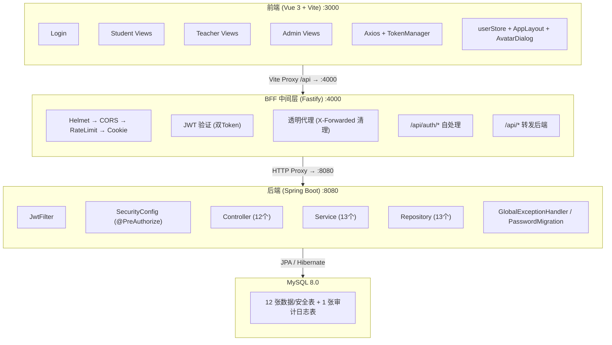
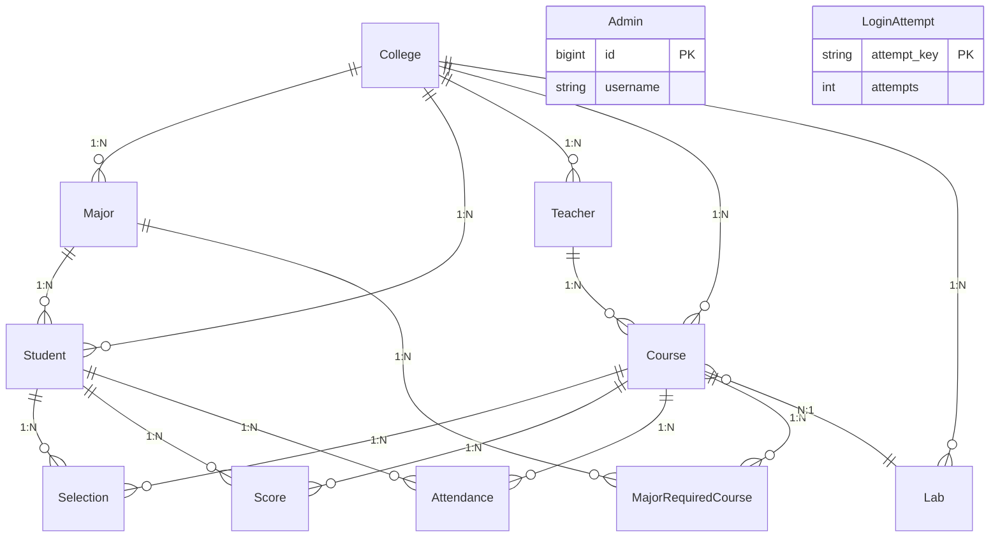

# 实验选课系统

<p align="center">
  
  
  
  
  
  
  
  
  
</p>

<p align="center">
  <strong>基于 Spring Boot + Vue 3 的高校实验室课程管理系统</strong>
</p>

---

## 目录

- [项目概述](#项目概述)
- [核心功能与特性](#核心功能与特性)
- [技术栈与架构](#技术栈与架构)
- [项目结构](#项目结构)
- [环境要求](#环境要求)
- [安装与配置](#安装与配置)
- [项目启动](#项目启动)
- [使用指南](#使用指南)
- [API 接口文档](#api-接口文档)
- [测试](#测试)
- [CI/CD 持续集成](#cicd-持续集成)
- [贡献指南](#贡献指南)
- [许可证信息](#许可证信息)
- [联系方式](#联系方式)

---

## 项目概述

实验选课系统是一个面向高校实验室课程管理的完整 Web 应用，采用 **前后端分离 + BFF 中间层** 的三层架构，为学生、教师和管理员三类角色提供一站式实验课程管理解决方案。系统涵盖选课、考勤签到、成绩管理、课表展示、学院/专业管理、系统管理等核心场景，以良好的用户体验和可靠的数据一致性为目标。

### 适用场景

- 高校实验室课程的信息化管理
- 学生在线选课与退课
- 教师考勤管理与成绩录入
- 管理员统一管理学生、教师、课程和实验室资源

### 项目亮点

- **JWT 双Token 无状态认证**：BFF 模式使用 HttpOnly Cookie 存储，refresh 仅接受 `bff_refresh_token`，支持自动刷新轮转
- **BCrypt 密码加密**：所有密码经 BCrypt 哈希存储，启动时自动迁移明文密码
- **三层架构**：前端 (Vue 3) + BFF 中间层 (Fastify) + 后端 (Spring Boot)，安全隔离
- **登录安全防护**：15 分钟内连续失败 5 次自动锁定 30 分钟（数据库持久化）
- **智能签到判定**：根据课程时间自动判定出勤/迟到，使用悲观锁防止并发重复签到
- **离线签到队列**：网络异常时暂存签到请求，恢复后自动同步
- **课表可视化**：解析课程时间并生成周课表，支持选课时间冲突检测
- **学院/专业管理层级模型**：引入 college 和 major 独立表，支持级联下拉、软删除
- **密码强度校验**：前后端一致校验密码复杂度（需包含大小写字母、数字、特殊符号中至少三种）
- **RBAC 权限控制**：基于 Spring Security 的三级角色权限模型，接口级细粒度控制
- **CI/CD 自动化**：GitHub Actions 自动运行 JUnit 测试与 API 集成测试
- **生产环境配置**：提供独立的 `application-prod.yml`，启动时拒绝缺失或危险的生产凭据

---

## 核心功能与特性

### 学生端

| 功能 | 描述 |
|------|------|
| 课程浏览 | 查看所有可选课程，展示课程名称、教师、实验室、上课时间、选课人数等信息 |
| 选课 / 退课 | 选择课程并自动检测时间冲突，支持退课操作 |
| 我的课程 | 查看已选课程列表及详细信息 |
| 课表展示 | 以周视图形式展示已选课程的时间安排，支持跨 Tab 实时刷新 |
| 考勤签到 | 一键签到，系统根据课程时间自动判定出勤/迟到状态 |
| 签到历史 | 查看个人所有签到记录，含课程名称、时间、状态 |
| 离线签到 | 网络异常时签到请求加入离线队列，网络恢复后自动同步 |

### 教师端

| 功能 | 描述 |
|------|------|
| 授课课程 | 查看本人负责的课程列表 |
| 选课学生 | 查看选修某课程的学生名单及详细信息 |
| 考勤管理 | 按日期查看学生考勤状态，支持将缺勤修改为请假（含修改原因记录） |
| 成绩管理 | 为学生录入和修改课程成绩 |
| 考勤导出 | 导出某课程的全部考勤数据，便于存档和统计分析 |

### 管理员端

| 功能 | 描述 |
|------|------|
| 学生管理 | 增删改查学生账号（学号、姓名、性别、学院、专业、密码） |
| 教师管理 | 增删改查教师账号（工号、姓名、职称、学院、密码） |
| 课程管理 | 增删改查课程信息（关联教师和实验室、设置上课时间、课程类型、所属学院） |
| 实验室管理 | 增删改查实验室信息（名称、地点、容量、所属学院） |
| 学院专业管理 | 学院/专业增删改查、软删除机制、级联下拉选择器 |

### 系统安全特性

| 特性 | 描述 |
|------|------|
| JWT 双Token 认证 | BFF 模式使用 HttpOnly Cookie 存储 Access Token (30min) + Refresh Token (7d) |
| BFF Token 边界 | `/api/auth/refresh` 只接受 `bff_refresh_token` Cookie，不接受 Authorization Header 或旧版 `bff_token` |
| BCrypt 加密 | 密码使用 BCrypt 不可逆加密存储 |
| 密码迁移 | 首次启动自动将数据库中明文密码升级为 BCrypt |
| 密码复杂度 | 前后端均校验 8-20 位、无空格、大小写/数字/特殊符号至少三类 |
| 登录锁定 | 同一账号 15 分钟内失败 5 次，锁定 30 分钟（数据库持久化） |
| 生产配置校验 | `prod` profile 下数据库凭据必须显式配置，拒绝 `root` / `123456` / `demo` 等演示配置 |
| 默认账号隔离 | demo seed 账号仅用于本地演示，生产环境不得导入 |
| 全局异常处理 | 统一异常拦截，返回标准化错误响应 |
| 参数校验 | 使用 `@Valid`、Spring Validation 和服务层白名单校验分页/排序/外键参数 |
| 敏感日志脱敏 | BFF 日志统一脱敏 Authorization、Token、密码、查询参数等敏感字段 |
| CORS 保护 | 仅允许前端/BFF 开发服务器来源的跨域请求 |
| Helmet 安全头 | CSP、X-Frame-Options 等安全头 (BFF) |
| 速率限制 | 全局 100次/分钟/IP (BFF) |
| Token 轮转 | Refresh Token 使用后立即失效，颁发新 Token 对 |
| 测试数据清理隔离 | `/api/admin/cleanup-test-data` 仅在 `dev` / `test` profile 注册 |

---

## 技术栈与架构

### 后端技术栈

| 技术 | 版本 | 用途 |
|------|------|------|
| Java | 25 | 核心编程语言 |
| Spring Boot | 4.0.0 | 应用框架 |
| Spring Security | 7.0.0 | 认证与授权 |
| Spring Data JPA | 4.0.0 | ORM 与数据访问 |
| Hibernate | 7.0.0 | JPA 实现 |
| JJWT | 0.12.3 | JWT Token 生成与解析 |
| MySQL | 8.0 | 关系型数据库 |
| HikariCP | — | 数据库连接池 |
| Lombok | 1.18.34 | 代码简化 |
| Maven | 3.9 | 项目构建 |
| JUnit 5 | — | 单元测试框架 |

### BFF 中间层技术栈

| 技术 | 版本 | 用途 |
|------|------|------|
| Fastify | 4.28.0 | Node.js Web 框架 |
| @fastify/cookie | 9.4.0 | Cookie 处理 |
| @fastify/cors | 9.0.1 | CORS 跨域 |
| @fastify/helmet | 11.1.1 | 安全头 |
| @fastify/rate-limit | 9.1.0 | 速率限制 |
| jsonwebtoken | 9.0.2 | JWT 验证 |

### 前端技术栈

| 技术 | 版本 | 用途 |
|------|------|------|
| Vue | 3.4 | 渐进式 JavaScript 框架 |
| Vue Router | 4.2.5 | 前端路由管理 |
| Vite | 5.0.8 | 开发服务器与构建工具 |
| Axios | 1.6.2 | HTTP 客户端 |
| Element Plus | 2.4.4 | UI 组件库 |
| XLSX | 0.18.5 | Excel 数据导出 |
| Vitest | 4.1.8 | 前端单元测试 |

### 系统架构



### 数据库 ER 关系



---

## 项目结构

```
d:\789\
├── .github/
│   └── workflows/
│       └── attendance-ci.yml          # GitHub Actions CI 配置
│
├── backend/                           # 后端项目 (Spring Boot 4.0.0)
│   ├── src/main/java/com/labcourse/
│   │   ├── config/
│   │   │   ├── SecurityConfig.java    # Spring Security + CORS 配置
│   │   │   ├── GlobalExceptionHandler.java  # 全局异常处理
│   │   │   ├── PasswordMigration.java       # 明文密码自动迁移
│   │   │   └── WebMvcConfig.java           # 静态资源映射（头像）
│   │   ├── controller/                # 12 个控制器
│   │   │   ├── AuthController.java    # Token 刷新与验证
│   │   │   ├── AdminController.java   # 管理员登录
│   │   │   ├── StudentController.java # 学生登录与管理
│   │   │   ├── TeacherController.java # 教师登录与管理
│   │   │   ├── CourseController.java  # 课程管理
│   │   │   ├── LabController.java     # 实验室管理
│   │   │   ├── SelectionController.java # 选课管理
│   │   │   ├── ScoreController.java   # 成绩管理
│   │   │   ├── AttendanceController.java # 考勤管理
│   │   │   ├── CollegeController.java # 学院管理
│   │   │   ├── MajorController.java   # 专业管理
│   │   │   └── UserController.java    # 用户信息/头像/密码
│   │   ├── entity/                    # 14 个实体类
│   │   ├── exception/
│   │   │   └── AccountLockedException.java # 账号锁定异常
│   │   ├── filter/
│   │   │   └── JwtFilter.java         # JWT 认证过滤器
│   │   ├── repository/                # 13 个 JPA Repository
│   │   ├── service/                   # 13 个 Service 接口
│   │   │   ├── impl/                  # 12 个 Service 实现
│   │   │   └── LoginAttemptService.java # 登录尝试限制
│   │   ├── util/
│   │   │   └── JwtUtil.java           # JWT 工具类
│   │   └── LabCourseApplication.java  # 启动类
│   ├── src/main/resources/
│   │   ├── application.yml            # 默认配置
│   │   └── application-prod.yml       # 生产环境配置
│   ├── src/test/java/com/labcourse/   # 28 个测试类
│   └── pom.xml
│
├── bff/                               # BFF 中间层 (Fastify 4.28.0)
│   ├── src/
│   │   ├── index.js                   # 入口 (Helmet + RateLimit + 双Token)
│   │   ├── config.js                  # 配置 (双Token Cookie 名称/有效期)
│   │   ├── routes/auth.js             # 认证路由 (登录/刷新/登出)
│   │   ├── middleware/
│   │   │   ├── jwtVerify.js           # JWT 验证
│   │   │   ├── errorHandler.js        # 错误处理
│   │   │   └── requestLogger.js       # 请求日志
│   │   ├── proxy/
│   │   │   ├── transparentProxy.js    # 透明代理 (X-Forwarded清理)
│   │   │   └── proxyMapping.js        # 路由认证映射
│   │   ├── services/backendClient.js  # 后端 HTTP 客户端
│   │   └── utils/logger.js            # 日志工具 (脱敏)
│   ├── tests/                         # 9 个测试文件
│   └── package.json
│
├── frontend/                          # 前端项目 (Vue 3 + Vite)
│   ├── src/
│   │   ├── api/                       # API 接口封装 (12 个)
│   │   ├── router/index.js            # 路由配置 + 导航守卫
│   │   ├── stores/userStore.js        # 用户状态管理 (Vue Reactive)
│   │   ├── components/                # 全局组件
│   │   │   ├── AppLayout.vue          # 通用布局（侧边栏 + 主区域）
│   │   │   └── AvatarDialog.vue       # 个人信息弹窗（头像 + 修改密码）
│   │   ├── config/layoutConfig.js     # 三种角色布局配置
│   │   ├── assets/                    # 静态资源 (SVG图标/头像占位图)
│   │   ├── utils/                     # 工具模块 (7 个)
│   │   ├── views/                     # 视图组件 (17 个)
│   │   │   ├── Login.vue
│   │   │   ├── student/ (6)  teacher/ (5)  admin/ (6)
│   │   └── styles/global.css
│   ├── tests/e2e/                     # E2E 测试 (14 个用例)
│   ├── index.html
│   ├── package.json
│   └── vite.config.js
│
├── database/                          # 数据库脚本 (21 个)
│   ├── init_database.sql              # 主初始化脚本
│   ├── procedures.sql                 # 存储过程
│   ├── views_and_triggers.sql         # 视图与触发器
│   ├── queries.sql                    # 常用查询示例
│   ├── migrate_v1_to_v2.sql           # v1→v2 迁移
│   ├── rollback_v2_to_v1.sql          # v2→v1 回滚
│   └── migrations/                    # 迁移脚本目录
│
└── README.md                          # 本文档
```

---

## 环境要求

| 环境 | 最低版本 | 说明 |
|------|---------|------|
| JDK | 25 | 需要配置 `JAVA_HOME` 环境变量 |
| Node.js | 18 | 前端构建与 BFF 运行 |
| MySQL | 8.0 | 数据库服务，默认端口 3306 |
| Maven | 3.6 | 后端项目构建 |
| npm | 9.x | 前端/BFF 依赖管理 |

---

## 安装与配置

### 步骤 1：克隆项目

```bash
git clone <repository-url>
cd d:\789
```

### 步骤 2：配置数据库

#### 2.1 创建数据库并导入初始数据

```bash
# 登录 MySQL
mysql -u root -p

# 执行初始化脚本
mysql> source d:/789/database/init_database.sql
```

该脚本会自动完成以下操作：
- 创建 `lab_course_system` 数据库（utf8mb4 编码）
- 创建 12 张数据/安全表 + 1 张审计日志表，含外键约束和索引
- 创建存储过程、视图与触发器
- 插入本地演示种子数据：1 个管理员、3 位教师、5 名学生、5 间实验室、5 门课程

> 生产环境不得导入包含默认账号的 demo seed 数据。生产初始化应使用单独脚本或迁移流程创建必要结构，并为管理员、教师、学生账号设置强密码。

#### 2.2 验证数据库

```bash
mysql -u root -p -e "USE lab_course_system; SHOW TABLES;"
```

### 步骤 3：配置后端

编辑 `backend/src/main/resources/application.yml`，修改数据库连接信息：

```yaml
spring:
  datasource:
    url: jdbc:mysql://localhost:3306/lab_course_system?useUnicode=true&characterEncoding=utf8&serverTimezone=Asia/Shanghai&useSSL=false
    username: root          # 修改为你的 MySQL 用户名
    password: 123456         # 修改为你的 MySQL 密码
```

也可以通过环境变量覆盖配置（无需修改文件）：

```powershell
# Windows PowerShell
$env:DB_URL="jdbc:mysql://localhost:3306/lab_course_system?useUnicode=true&characterEncoding=utf8&serverTimezone=Asia/Shanghai&useSSL=false"
$env:DB_USERNAME="root"
$env:DB_PASSWORD="your_password"
$env:JWT_SECRET="replace-with-at-least-32-random-characters"
```

`JWT_SECRET` 必须显式配置；测试环境由 Maven Surefire 单独注入，生产/本地启动不要使用弱默认密钥。

生产环境使用 `application-prod.yml` 时，`DB_USERNAME` 和 `DB_PASSWORD` 必须通过环境变量或部署平台显式配置，且不能使用 `root` / `123456` / `demo` 等演示凭据。
启动校验会在 `prod` profile 下拒绝缺失数据库凭据、弱 JWT 密钥和演示账号配置。

### 步骤 4：配置前端

前端开发环境已预配置 Vite 代理，`/api` 请求自动转发到 `http://localhost:8080`，无需额外修改。

如需修改，编辑 `frontend/vite.config.js`：

```javascript
server: {
  port: 3000,
  proxy: {
    '/api': {
      target: 'http://localhost:8080',  // 后端地址
      changeOrigin: true
    }
  }
}
```

---

## 项目启动

### 启动后端

```bash
cd backend

# 方式一：Maven 直接启动（开发模式）
mvn spring-boot:run

# 方式二：使用生产环境配置
mvn spring-boot:run -Dspring-boot.run.profiles=prod

# 方式三：先编译打包再运行
mvn clean package -DskipTests
java -jar target/lab-course-system-1.0.0.jar
```

启动成功标志：

```
Started LabCourseApplication in X.XXX seconds
```

后端服务运行在 `http://localhost:8080`。

### 启动 BFF 中间层 (推荐)

```bash
cd bff

# 安装依赖（仅首次）
npm install

# 配置环境变量（首次启动前）
cp .env.example .env
# 编辑 .env，将 JWT_SECRET 改为至少 32 位随机强密钥

# 启动开发模式
npm run dev
```

BFF 服务运行在 `http://localhost:4000`。
`JWT_SECRET` 必须与后端使用同一个密钥，否则 BFF 无法验证后端签发的 Token。

### 启动前端

```bash
cd frontend

# 安装依赖（仅首次）
npm install

# 启动开发服务器
npm run dev
```

启动成功标志：

```
VITE v5.4.11  ready in XXX ms
➜  Local:   http://localhost:3000/
```

### 访问系统

打开浏览器访问 **http://localhost:3000**，使用以下本地演示账号登录：

| 角色 | 账号 | 密码 | 说明 |
|------|------|------|------|
| 管理员 | admin | 123456 | 系统管理后台 |
| 教师 | T001 | 123456 | 张三 (教授) |
| 教师 | T002 | 123456 | 李四 (副教授) |
| 教师 | T003 | 123456 | 王五 (讲师) |
| 学生 | S001 | 123456 | 王小明 (计算机科学与技术) |
| 学生 | S002 | 123456 | 李小红 (软件工程) |

> **注意**：
> - 上表账号仅用于本地演示数据库。生产环境不得导入包含默认账号的 demo seed 数据，必须使用独立的生产初始化与强密码。
> - 首次启动时，`PasswordMigration` 会自动将数据库中的明文密码升级为 BCrypt 加密存储，后续启动不会重复迁移。
> - 默认使用 BFF 模式（`VITE_BFF_ENABLED=true`），前端请求通过 BFF 代理到后端。如需直连后端，修改 `frontend/.env.development` 中 `VITE_BFF_ENABLED=false`。

---

## 使用指南

### 学生端操作流程

1. **登录**：使用学号 `S001` 和密码 `123456` 登录，进入学生首页
2. **浏览课程**：在「课程列表」页面查看所有可选课程，包括课程名称、授课教师、实验室、上课时间、已选/最大人数
3. **选课**：点击「选课」按钮，系统自动检测时间冲突。若冲突，弹出提示并显示冲突课程
4. **查看课表**：在「我的课表」页面以周视图形式查看已选课程的时间安排
5. **签到**：在「考勤签到」页面，系统根据当前时间和课程安排自动判定出勤或迟到
6. **查看签到历史**：在「签到记录」页面查看所有历史签到详情
7. **退课**：在「我的课程」页面取消已选课程

### 教师端操作流程

1. **登录**：使用工号 `T001` 和密码 `123456` 登录，进入教师首页
2. **查看课程**：在「我的课程」页面查看授课课程列表
3. **查看学生**：点击课程进入学生列表，查看选课学生信息
4. **考勤管理**：在「考勤管理」页面按日期查看学生出勤/缺勤/迟到/请假状态
5. **修改考勤**：可将缺勤状态修改为请假，需填写修改原因
6. **成绩录入**：在「成绩管理」页面为学生录入或修改成绩
7. **导出数据**：点击导出按钮下载考勤数据

### 管理员端操作流程

1. **登录**：使用 `admin` 和密码 `123456` 登录，进入管理后台
2. **学生管理**：增删改查学生账号，设置密码时前后端都会校验密码强度
3. **教师管理**：增删改查教师账号
4. **课程管理**：创建课程时关联教师和实验室，设置上课时间格式如 `周一 1-2节`
5. **实验室管理**：管理实验室名称、地点和容量

### 密码校验规则

新增、修改学生/教师密码，以及通用改密和重置后生成的临时密码，系统要求满足以下条件：

- 长度 8-20 个字符
- 不能包含空格
- 必须包含大小写字母、数字、特殊符号中至少**三种**
- 必须输入两次确认密码且一致

后端使用同一套规则兜底校验；校验失败时接口返回业务错误，不会只依赖前端表单。

---

## API 接口文档

### 基础信息

- **默认 Base URL (BFF 模式)**：前端请求 `/api`，经 `http://localhost:4000` 转发到后端
- **后端直连 Base URL**：`http://localhost:8080/api`
- **Content-Type**：`application/json`
- **默认认证方式**：BFF 使用 HttpOnly Cookie 保存 `bff_access_token` 和 `bff_refresh_token`
- **后端直连认证方式**：Bearer Token（JWT）
- **Token 有效期**：Access Token 30 分钟，Refresh Token 7 天

### 通用响应格式

```json
// 成功
{
  "success": true,
  "data": { ... },
  "message": "操作成功"
}

// 失败
{
  "success": false,
  "message": "错误描述"
}

// 账号锁定 (HTTP 423)
{
  "success": false,
  "message": "账号已被锁定，请30分钟后重试",
  "locked": true,
  "remainingMinutes": 25
}
```

### 认证接口

| 方法 | 路径 | 认证 | 描述 |
|------|------|------|------|
| POST | `/api/student/login` | 否 | 学生登录 |
| POST | `/api/teacher/login` | 否 | 教师登录 |
| POST | `/api/admin/login` | 否 | 管理员登录 |
| POST | `/api/auth/refresh` | Cookie | BFF 模式刷新 Token，仅接受 `bff_refresh_token` |
| GET | `/api/auth/validate` | 是 | 验证 Token 有效性 |

### 管理与测试接口

| 方法 | 路径 | 角色 | 描述 |
|------|------|------|------|
| POST | `/api/admin/cleanup-test-data` | admin | 清理自动化测试数据，仅在 `dev` / `test` profile 注册 |

> 默认 profile 和 `prod` profile 下不会注册 `/api/admin/cleanup-test-data`，生产和预发环境不可调用该破坏性接口。

#### 登录请求示例

```json
// 学生登录
POST /api/student/login
{
  "studentNo": "S001",
  "password": "123456"
}

// 教师登录
POST /api/teacher/login
{
  "teacherNo": "T001",
  "password": "123456"
}

// 管理员登录
POST /api/admin/login
{
  "username": "admin",
  "password": "123456"
}
```

#### 登录成功响应 (BFF 模式)

BFF 模式下，响应体不返回 `accessToken` / `refreshToken`，Token 会写入 HttpOnly Cookie。

```json
{
  "success": true,
  "data": {
    "id": 1,
    "studentNo": "S001",
    "name": "王小明",
    "gender": "男",
    "majorId": 1,
    "collegeId": 1,
    "role": "student",
    "tokenExpireTime": 1719200000000
  },
  "message": "登录成功"
}
```

#### 登录成功响应 (后端直连)

后端直连时，登录响应会返回 Token，客户端需自行通过 `Authorization: Bearer <access-token>` 调用受保护接口。

```json
{
  "success": true,
  "data": {
    "id": 1,
    "studentNo": "S001",
    "name": "王小明",
    "gender": "男",
    "majorId": 1,
    "collegeId": 1
  },
  "accessToken": "eyJhbGciOiJIUzI1NiJ9...",
  "refreshToken": "eyJhbGciOiJIUzI1NiJ9...",
  "message": "登录成功"
}
```

#### Token 刷新 (BFF 模式)

```bash
POST /api/auth/refresh
Cookie: bff_refresh_token=<refresh-token>
```

Authorization Header 和旧版 `bff_token` 不会触发刷新。刷新失败或 Token 过期时，BFF 会清理 `bff_access_token`、`bff_refresh_token` 和旧版 `bff_token`。

```json
// 响应
{
  "success": true,
  "message": "Token refreshed",
  "expiresIn": 1800
}
```

#### Token 刷新 (后端直连)

```json
POST /api/auth/refresh
{
  "refreshToken": "<refresh-token>"
}
```

```json
{
  "success": true,
  "message": "Token刷新成功",
  "accessToken": "<new-access-token>",
  "refreshToken": "<new-refresh-token>"
}
```

### 学生接口

| 方法 | 路径 | 角色 | 描述 |
|------|------|------|------|
| GET | `/api/student/list` | admin | 查询所有学生 |
| POST | `/api/student/save` | admin | 新增学生 |
| PUT | `/api/student/update` | admin | 更新学生 |
| DELETE | `/api/student/{id}` | admin | 删除学生 |
| POST | `/api/student/reset-password/{id}` | admin | 重置学生密码 |

#### 重置学生密码响应

```json
{
  "success": true,
  "message": "密码重置成功",
  "data": {
    "temporaryPassword": "A8x#k2Pq"
  }
}
```

### 教师接口

| 方法 | 路径 | 角色 | 描述 |
|------|------|------|------|
| GET | `/api/teacher/list` | admin | 查询所有教师 |
| POST | `/api/teacher/save` | admin | 新增教师 |
| PUT | `/api/teacher/update` | admin | 更新教师 |
| DELETE | `/api/teacher/{id}` | admin | 删除教师 |
| POST | `/api/teacher/reset-password/{id}` | admin | 重置教师密码 |

#### 重置教师密码响应

```json
{
  "success": true,
  "message": "密码重置成功",
  "data": {
    "temporaryPassword": "A8x#k2Pq"
  }
}
```

### 课程接口

| 方法 | 路径 | 角色 | 描述 |
|------|------|------|------|
| GET | `/api/course/list` | 公开 | 查询所有课程 |
| POST | `/api/course/save` | admin | 新增课程 |
| PUT | `/api/course/update` | admin | 更新课程 |
| DELETE | `/api/course/{id}` | admin | 删除课程 |

### 实验室接口

| 方法 | 路径 | 角色 | 描述 |
|------|------|------|------|
| GET | `/api/lab/list` | admin | 查询所有实验室 |
| POST | `/api/lab/save` | admin | 新增实验室 |
| PUT | `/api/lab/update` | admin | 更新实验室 |
| DELETE | `/api/lab/{id}` | admin | 删除实验室 |

### 选课接口

| 方法 | 路径 | 角色 | 描述 |
|------|------|------|------|
| POST | `/api/selection/add` | student | 添加选课 |
| DELETE | `/api/selection/delete/{id}` | student | 删除选课 |
| GET | `/api/selection/my/{studentId}` | student | 查询已选课程 |
| GET | `/api/selection/studentList/{courseId}` | teacher | 查询课程选课学生 |

#### 选课请求

```json
POST /api/selection/add
{
  "studentId": 1,
  "courseId": 1
}
```

### 成绩接口

| 方法 | 路径 | 角色 | 描述 |
|------|------|------|------|
| POST | `/api/score/add` | teacher | 录入成绩 |
| GET | `/api/score/list` | teacher | 查询所有成绩 |

#### 录入成绩请求

```json
POST /api/score/add
{
  "studentId": 1,
  "courseId": 1,
  "score": 85.5
}
```

### 考勤接口

| 方法 | 路径 | 角色 | 描述 |
|------|------|------|------|
| POST | `/api/attendance/check-in` | student | 学生签到（自动判定状态） |
| GET | `/api/attendance/history` | student | 查询签到历史 |
| GET | `/api/attendance/course` | teacher | 按日期查询课程考勤 |
| GET | `/api/attendance/dates` | teacher | 获取考勤日期列表 |
| PUT | `/api/attendance/update-status` | teacher | 修改考勤状态（缺勤→请假） |
| GET | `/api/attendance/export` | teacher | 导出考勤数据 |
| GET | `/api/attendance/server-time` | student | 获取服务器时间 |

#### 签到请求

```json
POST /api/attendance/check-in
{
  "studentId": 1,
  "courseId": 1
}
```

#### 签到响应

```json
{
  "success": true,
  "message": "签到成功",
  "status": "出勤",
  "courseName": "Java程序设计",
  "studentName": "王小明",
  "checkInTime": "2026-06-12T08:05:00"
}
```

#### 修改考勤状态请求

```json
PUT /api/attendance/update-status
{
  "attendanceId": 10,
  "newStatus": "请假",
  "teacherId": 1,
  "reason": "学生提交了病假条"
}
```

---

## 测试

### 测试概览

| 项目 | 测试框架 | 测试文件数 | 覆盖范围 |
|------|---------|-----------|---------|
| 后端 | JUnit 5 + Mockito | 28 | 签到、考勤、密码、JWT、安全、数据库约束、服务层 |
| BFF | Vitest | 12 | 认证、JWT验证、代理、日志脱敏、错误处理、配置 |
| 前端 | Vitest | 10 | 密码校验器、Token管理、请求、课表解析、离线签到 |
| E2E | Playwright | 12 | 学院/专业 CRUD、级联下拉、表单提交、业务规则 |

### 后端测试用例明细

| 测试类 | 覆盖内容 |
|--------|---------|
| `AttendanceServiceTest` | 签到流程、考勤查询、状态修改、离线队列、数据一致性 (30 用例) |
| `CollegeFieldTest` | 学院字段约束、partial update、空值/超长边界 (14 用例) |
| `OfflineQueueRecoveryTest` | 离线队列恢复、数据损坏处理、并发访问 (16 用例) |
| `PasswordEncoderTest` | 密码编码、匹配验证、边界值 (10 用例) |
| `JwtUtilTest` | Token 生成、解析、过期验证 (9 用例) |
| `SecurityIntegrationTest` | 登录认证、权限控制、Token 安全 (8 用例) |
| `DatabaseConstraintTest` | 数据库外键约束验证 |
| `DatabaseUniqueIndexTest` | 唯一索引约束验证 |
| `DatabaseConcurrencyTest` | 并发场景数据库锁验证 |
| 各 ServiceImpl 测试 (8个) | Admin/Student/Teacher/Course/Lab/Score/Selection/Major 服务层 |
| `GlobalExceptionHandlerTest` | 全局异常处理 |
| `AuthControllerTest` | 认证控制器 |
| `LoginAttemptServiceTest` | 登录尝试限制 |
| `AttendanceLoggingTest` | 考勤日志输出 |
| `PasswordMigrationTest` | 密码自动迁移 |
| **总计** | **28 个测试类** |

### 运行测试

```bash
# 运行全部后端测试
mvn verify -f backend/pom.xml

# 仅运行单元测试
mvn test -f backend/pom.xml

# 运行指定测试类
mvn test -f backend/pom.xml -Dtest=AttendanceServiceTest

# BFF 测试
cd bff && npm test

# 前端单元测试
cd frontend && npm test

# 前端 E2E 测试
cd frontend && npx playwright test
npx playwright test --headed                # 有头模式
npx playwright test tests/e2e/college/      # 按分类运行
npx playwright show-report playwright-report # 查看报告

# 构建与依赖审计
cd frontend && npm run build
cd bff && npm audit --omit=dev --registry=https://registry.npmjs.org
cd frontend && npm audit --omit=dev --registry=https://registry.npmjs.org
mvn -q -DskipTests dependency:tree -f backend/pom.xml
```

### 测试报告

测试报告位于 `backend/target/surefire-reports/`，包含 TXT 和 XML 格式的详细结果。

---

## CI/CD 持续集成

项目配置了 GitHub Actions 自动化流水线（`.github/workflows/attendance-ci.yml`），在 `push` 和 `pull_request` 到 `main` 分支时自动触发：

```yaml
流水线阶段:
  1. Backend JUnit Tests  →  编译 + 数据库初始化 + 运行全部 331 个后端测试
  2. API Integration Tests →  集成测试验证
  3. Notify on Failure     →  失败时生成摘要报告
```

CI 流程包含：
- MySQL 8.0 服务容器
- JDK 25 (Temurin) 环境
- 自动发布 JUnit 测试报告
- 上传测试报告为构建产物
- 失败时自动通知

---

## 贡献指南

### 代码规范

- **后端**：遵循 Spring Boot 三层架构（Controller → Service → Repository），使用 Lombok 简化代码
- **前端**：使用 Vue 3 Composition API（`<script setup>`），API 调用统一封装在 `src/api/` 目录下
- **命名规范**：Java 类使用 PascalCase，方法使用 camelCase；Vue 组件使用 PascalCase

### 添加新功能

1. **后端**：创建 Entity → Repository → Service 接口 → Service 实现 → Controller
2. **前端**：创建 API 封装 → Vue 视图组件 → 在 `router/index.js` 注册路由
3. **数据库**：在 `init_database.sql` 中添加表结构变更

### 提交规范

- 提交前确保通过 `mvn verify` 和 `npm run build`
- 提交信息使用中文，简要描述变更内容

---

## 许可证信息

本项目仅用于学习和教育目的，不作为商业用途。

---

## 联系方式

如有问题或建议，请通过以下方式联系：

- 提交 Issue 至项目仓库
- 通过 Pull Request 贡献代码

---

<p align="center">
  <strong>实验选课系统 — 高效、安全、可靠的实验室课程管理平台</strong>
</p>

<p align="center">
  <sub>版本 2.3.0 | 最后更新 2026-06-20</sub>
</p>
